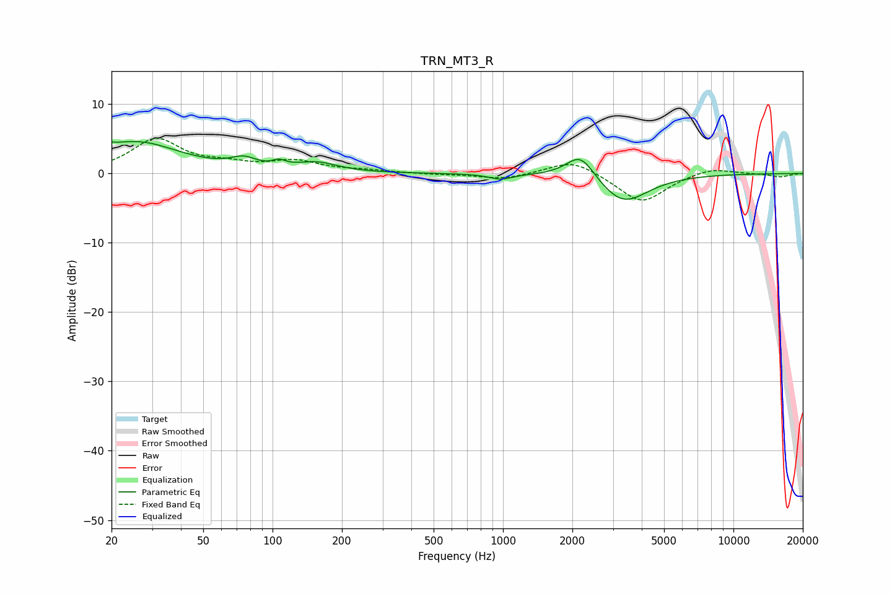

# TRN_MT3_R
See [usage instructions](https://github.com/jaakkopasanen/AutoEq#usage) for more options and info.

### Parametric EQs
Apply preamp of -4.7 dB when using parametric equalizer.

|   # | Type    |   Fc (Hz) |    Q |   Gain (dB) |
|-----|---------|-----------|------|-------------|
|   1 | Peaking |        20 | 5.81 |         3.3 |
|   2 | Peaking |        20 | 5.97 |        -2.7 |
|   3 | Peaking |        25 | 0.76 |         4.5 |
|   4 | Peaking |        75 | 2.56 |         1.4 |
|   5 | Peaking |       106 | 3.89 |        -1.2 |
|   6 | Peaking |       106 | 4.35 |         1.9 |
|   7 | Peaking |       155 | 1.58 |         1.4 |
|   8 | Peaking |       979 | 2.77 |        -0.8 |
|   9 | Peaking |      2170 | 2.25 |         3.8 |
|  10 | Peaking |      3318 | 1.32 |        -4.4 |

### Fixed Band EQs
When using fixed band (also called graphic) equalizer, apply preamp of **-5.2 dB** (if available) and set gains manually with these parameters.

|   # | Type    |   Fc (Hz) |    Q |   Gain (dB) |
|-----|---------|-----------|------|-------------|
|   1 | Peaking |        31 | 1.41 |         4.8 |
|   2 | Peaking |        62 | 1.41 |         1   |
|   3 | Peaking |       125 | 1.41 |         1.6 |
|   4 | Peaking |       250 | 1.41 |         0.4 |
|   5 | Peaking |       500 | 1.41 |        -0.1 |
|   6 | Peaking |      1000 | 1.41 |        -0.8 |
|   7 | Peaking |      2000 | 1.41 |         2.1 |
|   8 | Peaking |      4000 | 1.41 |        -4.3 |
|   9 | Peaking |      8000 | 1.41 |         1   |
|  10 | Peaking |     16000 | 1.41 |        -0.5 |

### Graphs

