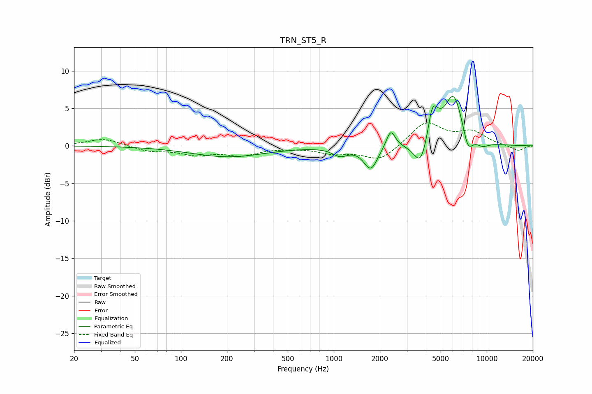

# TRN_ST5_R
See [usage instructions](https://github.com/jaakkopasanen/AutoEq#usage) for more options and info.

### Parametric EQs
Apply preamp of -6.7 dB when using parametric equalizer.

|   # | Type    |   Fc (Hz) |    Q |   Gain (dB) |
|-----|---------|-----------|------|-------------|
|   1 | Peaking |       203 | 0.58 |        -1.5 |
|   2 | Peaking |      1099 | 2.89 |        -1.1 |
|   3 | Peaking |      1743 | 3.15 |        -3.1 |
|   4 | Peaking |      2355 | 4.82 |         2.4 |
|   5 | Peaking |      3709 | 3.1  |        -3.7 |
|   6 | Peaking |      4364 | 6    |         1.7 |
|   7 | Peaking |      4518 | 3.56 |         3.1 |
|   8 | Peaking |      6075 | 2.17 |         6.9 |
|   9 | Peaking |      7520 | 4.06 |        -2.8 |
|  10 | Peaking |      9341 | 2.92 |        -0.7 |

### Fixed Band EQs
When using fixed band (also called graphic) equalizer, apply preamp of **-3.2 dB** (if available) and set gains manually with these parameters.

|   # | Type    |   Fc (Hz) |    Q |   Gain (dB) |
|-----|---------|-----------|------|-------------|
|   1 | Peaking |        31 | 1.41 |         1   |
|   2 | Peaking |        62 | 1.41 |        -0.7 |
|   3 | Peaking |       125 | 1.41 |        -1   |
|   4 | Peaking |       250 | 1.41 |        -1.1 |
|   5 | Peaking |       500 | 1.41 |        -0.1 |
|   6 | Peaking |      1000 | 1.41 |        -0.9 |
|   7 | Peaking |      2000 | 1.41 |        -2   |
|   8 | Peaking |      4000 | 1.41 |         3.2 |
|   9 | Peaking |      8000 | 1.41 |         1.7 |
|  10 | Peaking |     16000 | 1.41 |        -0.7 |

### Graphs

