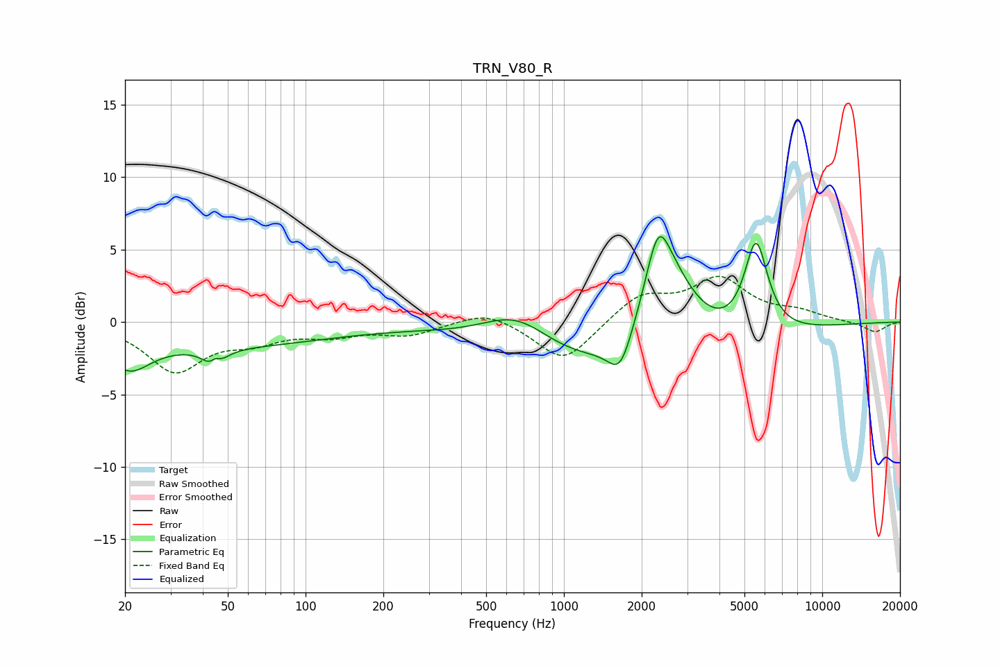

# TRN_V80_R
See [usage instructions](https://github.com/jaakkopasanen/AutoEq#usage) for more options and info.

### Parametric EQs
Apply preamp of -6.0 dB when using parametric equalizer.

|   # | Type    |   Fc (Hz) |    Q |   Gain (dB) |
|-----|---------|-----------|------|-------------|
|   1 | Peaking |        21 | 1.68 |        -2.3 |
|   2 | Peaking |        44 | 4.39 |        -2.6 |
|   3 | Peaking |        45 | 6    |         1.9 |
|   4 | Peaking |        50 | 0.35 |        -1.6 |
|   5 | Peaking |       660 | 1.02 |         2.5 |
|   6 | Peaking |      1655 | 2.97 |        -2.7 |
|   7 | Peaking |      1758 | 0.34 |        -4.4 |
|   8 | Peaking |      2312 | 3.32 |         3.6 |
|   9 | Peaking |      2482 | 1.22 |         6.9 |
|  10 | Peaking |      5544 | 3.04 |         6.4 |

### Fixed Band EQs
When using fixed band (also called graphic) equalizer, apply preamp of **-3.2 dB** (if available) and set gains manually with these parameters.

|   # | Type    |   Fc (Hz) |    Q |   Gain (dB) |
|-----|---------|-----------|------|-------------|
|   1 | Peaking |        31 | 1.41 |        -3.3 |
|   2 | Peaking |        62 | 1.41 |        -1.1 |
|   3 | Peaking |       125 | 1.41 |        -0.8 |
|   4 | Peaking |       250 | 1.41 |        -0.8 |
|   5 | Peaking |       500 | 1.41 |         0.9 |
|   6 | Peaking |      1000 | 1.41 |        -2.8 |
|   7 | Peaking |      2000 | 1.41 |         1.8 |
|   8 | Peaking |      4000 | 1.41 |         2.8 |
|   9 | Peaking |      8000 | 1.41 |         0.6 |
|  10 | Peaking |     16000 | 1.41 |        -0.7 |

### Graphs

