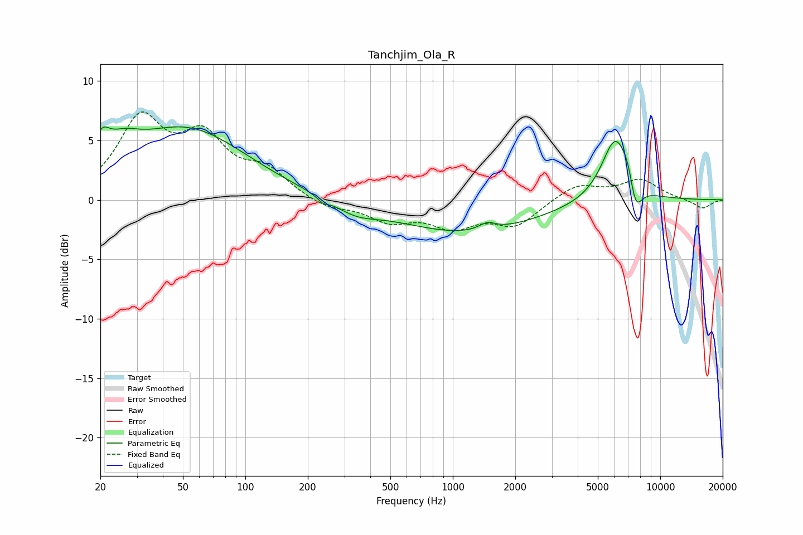

# Tanchjim_Ola_R
See [usage instructions](https://github.com/jaakkopasanen/AutoEq#usage) for more options and info.

### Parametric EQs
Apply preamp of -6.2 dB when using parametric equalizer.

|   # | Type    |   Fc (Hz) |    Q |   Gain (dB) |
|-----|---------|-----------|------|-------------|
|   1 | Peaking |        20 | 3.72 |         2.2 |
|   2 | Peaking |        26 | 1.72 |         1.7 |
|   3 | Peaking |        52 | 0.49 |         5.9 |
|   4 | Peaking |       236 | 5.95 |        -0.4 |
|   5 | Peaking |       340 | 1.36 |        -1   |
|   6 | Peaking |      1168 | 0.42 |        -2.7 |
|   7 | Peaking |      1467 | 3.49 |         0.6 |
|   8 | Peaking |      6077 | 2.04 |         5.5 |
|   9 | Peaking |      7125 | 4.12 |         2.2 |
|  10 | Peaking |      7507 | 3.89 |        -3.8 |

### Fixed Band EQs
When using fixed band (also called graphic) equalizer, apply preamp of **-7.5 dB** (if available) and set gains manually with these parameters.

|   # | Type    |   Fc (Hz) |    Q |   Gain (dB) |
|-----|---------|-----------|------|-------------|
|   1 | Peaking |        31 | 1.41 |         6.4 |
|   2 | Peaking |        62 | 1.41 |         4.6 |
|   3 | Peaking |       125 | 1.41 |         2.1 |
|   4 | Peaking |       250 | 1.41 |        -0.8 |
|   5 | Peaking |       500 | 1.41 |        -1.6 |
|   6 | Peaking |      1000 | 1.41 |        -2   |
|   7 | Peaking |      2000 | 1.41 |        -2.1 |
|   8 | Peaking |      4000 | 1.41 |         1.3 |
|   9 | Peaking |      8000 | 1.41 |         1.6 |
|  10 | Peaking |     16000 | 1.41 |        -0.8 |

### Graphs

