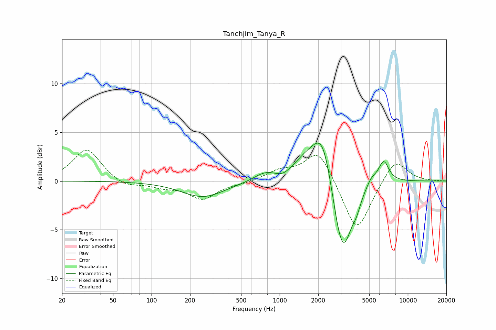

# Tanchjim_Tanya_R
See [usage instructions](https://github.com/jaakkopasanen/AutoEq#usage) for more options and info.

### Parametric EQs
Apply preamp of -4.0 dB when using parametric equalizer.

|   # | Type    |   Fc (Hz) |    Q |   Gain (dB) |
|-----|---------|-----------|------|-------------|
|   1 | Peaking |       253 | 0.84 |        -1.7 |
|   2 | Peaking |       762 | 1.72 |         0.8 |
|   3 | Peaking |      1066 | 2.58 |        -0.5 |
|   4 | Peaking |      1610 | 1.23 |         1.8 |
|   5 | Peaking |      2175 | 1.77 |         5   |
|   6 | Peaking |      2845 | 2.11 |        -2.7 |
|   7 | Peaking |      3161 | 2.14 |        -6   |
|   8 | Peaking |      3975 | 3.93 |        -1.2 |
|   9 | Peaking |      5216 | 3.82 |         0.7 |
|  10 | Peaking |      6475 | 3.35 |         2.2 |

### Fixed Band EQs
When using fixed band (also called graphic) equalizer, apply preamp of **-3.3 dB** (if available) and set gains manually with these parameters.

|   # | Type    |   Fc (Hz) |    Q |   Gain (dB) |
|-----|---------|-----------|------|-------------|
|   1 | Peaking |        31 | 1.41 |         3.3 |
|   2 | Peaking |        62 | 1.41 |        -0.7 |
|   3 | Peaking |       125 | 1.41 |        -0.5 |
|   4 | Peaking |       250 | 1.41 |        -1.8 |
|   5 | Peaking |       500 | 1.41 |        -0.2 |
|   6 | Peaking |      1000 | 1.41 |         1   |
|   7 | Peaking |      2000 | 1.41 |         3.3 |
|   8 | Peaking |      4000 | 1.41 |        -5.4 |
|   9 | Peaking |      8000 | 1.41 |         2.4 |
|  10 | Peaking |     16000 | 1.41 |         0   |

### Graphs

