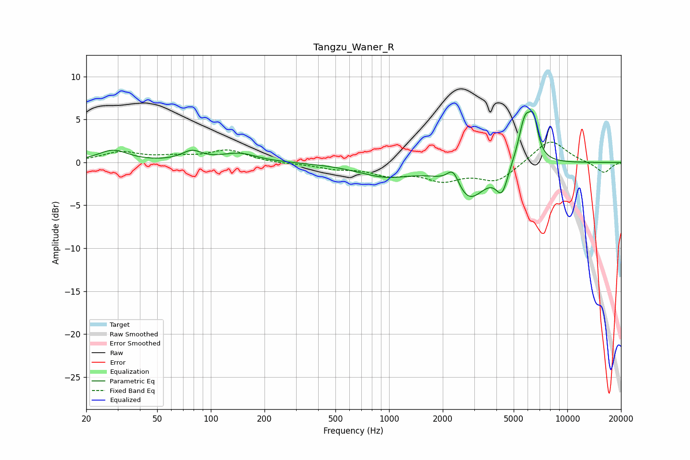

# Tangzu_Waner_R
See [usage instructions](https://github.com/jaakkopasanen/AutoEq#usage) for more options and info.

### Parametric EQs
Apply preamp of -6.0 dB when using parametric equalizer.

|   # | Type    |   Fc (Hz) |    Q |   Gain (dB) |
|-----|---------|-----------|------|-------------|
|   1 | Peaking |        28 | 1.72 |         1.4 |
|   2 | Peaking |        78 | 2.55 |         1.1 |
|   3 | Peaking |       144 | 1.42 |         1   |
|   4 | Peaking |       957 | 0.89 |        -1.5 |
|   5 | Peaking |      2291 | 4.05 |         2.2 |
|   6 | Peaking |      2775 | 1.5  |        -3.9 |
|   7 | Peaking |      2890 | 1.83 |        -0.4 |
|   8 | Peaking |      4299 | 4.17 |        -3   |
|   9 | Peaking |      5800 | 3.62 |         5.3 |
|  10 | Peaking |      6471 | 5.7  |         3.4 |

### Fixed Band EQs
When using fixed band (also called graphic) equalizer, apply preamp of **-2.5 dB** (if available) and set gains manually with these parameters.

|   # | Type    |   Fc (Hz) |    Q |   Gain (dB) |
|-----|---------|-----------|------|-------------|
|   1 | Peaking |        31 | 1.41 |         1.1 |
|   2 | Peaking |        62 | 1.41 |         0.5 |
|   3 | Peaking |       125 | 1.41 |         1.4 |
|   4 | Peaking |       250 | 1.41 |        -0.1 |
|   5 | Peaking |       500 | 1.41 |        -0.6 |
|   6 | Peaking |      1000 | 1.41 |        -1.2 |
|   7 | Peaking |      2000 | 1.41 |        -1.8 |
|   8 | Peaking |      4000 | 1.41 |        -2.1 |
|   9 | Peaking |      8000 | 1.41 |         2.8 |
|  10 | Peaking |     16000 | 1.41 |        -1.3 |

### Graphs

