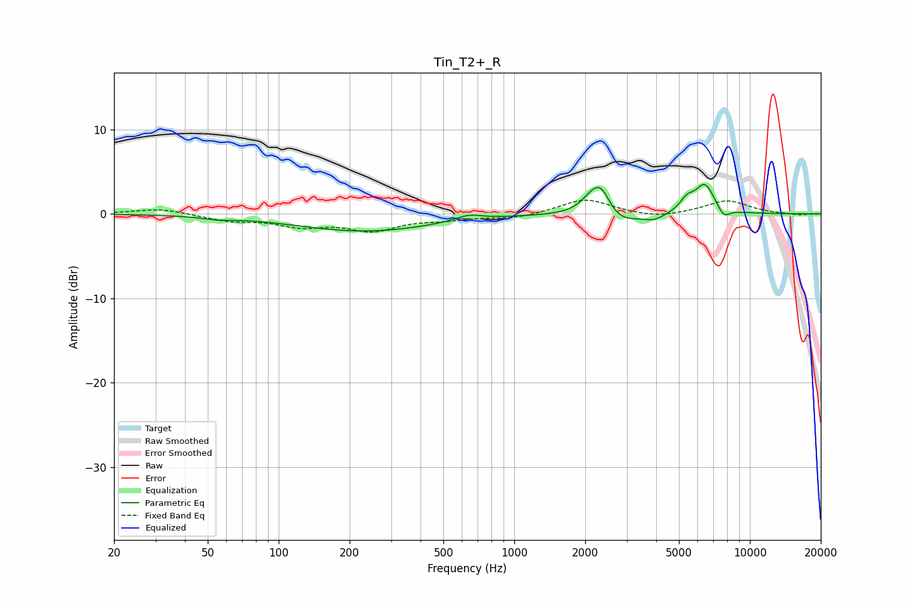

# Tin_T2+_R
See [usage instructions](https://github.com/jaakkopasanen/AutoEq#usage) for more options and info.

### Parametric EQs
Apply preamp of -3.6 dB when using parametric equalizer.

|   # | Type    |   Fc (Hz) |    Q |   Gain (dB) |
|-----|---------|-----------|------|-------------|
|   1 | Peaking |        55 | 2.16 |        -0.3 |
|   2 | Peaking |       232 | 0.48 |        -2   |
|   3 | Peaking |       641 | 2.56 |         0.7 |
|   4 | Peaking |      2116 | 2.89 |         1.4 |
|   5 | Peaking |      2329 | 3.33 |         3.2 |
|   6 | Peaking |      2739 | 1.84 |        -1.5 |
|   7 | Peaking |      3923 | 3.06 |        -0.7 |
|   8 | Peaking |      5397 | 4.84 |         1.2 |
|   9 | Peaking |      6436 | 3.2  |         3.5 |
|  10 | Peaking |      7737 | 5.05 |        -1.2 |

### Fixed Band EQs
When using fixed band (also called graphic) equalizer, apply preamp of **-1.7 dB** (if available) and set gains manually with these parameters.

|   # | Type    |   Fc (Hz) |    Q |   Gain (dB) |
|-----|---------|-----------|------|-------------|
|   1 | Peaking |        31 | 1.41 |         0.6 |
|   2 | Peaking |        62 | 1.41 |        -0.8 |
|   3 | Peaking |       125 | 1.41 |        -1.3 |
|   4 | Peaking |       250 | 1.41 |        -1.8 |
|   5 | Peaking |       500 | 1.41 |        -0.5 |
|   6 | Peaking |      1000 | 1.41 |        -0.5 |
|   7 | Peaking |      2000 | 1.41 |         1.8 |
|   8 | Peaking |      4000 | 1.41 |        -0.5 |
|   9 | Peaking |      8000 | 1.41 |         1.6 |
|  10 | Peaking |     16000 | 1.41 |        -0.2 |

### Graphs

