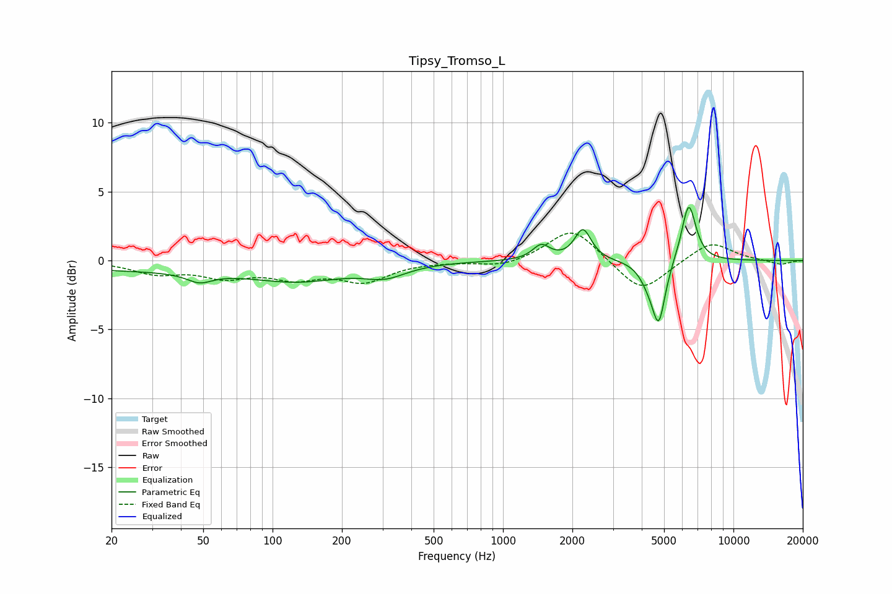

# Tipsy_Tromso_L
See [usage instructions](https://github.com/jaakkopasanen/AutoEq#usage) for more options and info.

### Parametric EQs
Apply preamp of -3.9 dB when using parametric equalizer.

|   # | Type    |   Fc (Hz) |    Q |   Gain (dB) |
|-----|---------|-----------|------|-------------|
|   1 | Peaking |        27 | 0.31 |        -0.7 |
|   2 | Peaking |        48 | 2.63 |        -0.7 |
|   3 | Peaking |       131 | 0.67 |        -1.3 |
|   4 | Peaking |       292 | 1.88 |        -0.2 |
|   5 | Peaking |       315 | 1.54 |        -0.6 |
|   6 | Peaking |      1465 | 3.83 |         1.1 |
|   7 | Peaking |      2222 | 4.01 |         2.2 |
|   8 | Peaking |      4278 | 3.6  |        -1   |
|   9 | Peaking |      4743 | 4.94 |        -4.2 |
|  10 | Peaking |      6397 | 4.42 |         4.3 |

### Fixed Band EQs
When using fixed band (also called graphic) equalizer, apply preamp of **-2.1 dB** (if available) and set gains manually with these parameters.

|   # | Type    |   Fc (Hz) |    Q |   Gain (dB) |
|-----|---------|-----------|------|-------------|
|   1 | Peaking |        31 | 1.41 |        -0.8 |
|   2 | Peaking |        62 | 1.41 |        -1.1 |
|   3 | Peaking |       125 | 1.41 |        -1.1 |
|   4 | Peaking |       250 | 1.41 |        -1.4 |
|   5 | Peaking |       500 | 1.41 |        -0   |
|   6 | Peaking |      1000 | 1.41 |        -0.5 |
|   7 | Peaking |      2000 | 1.41 |         2.5 |
|   8 | Peaking |      4000 | 1.41 |        -2.4 |
|   9 | Peaking |      8000 | 1.41 |         1.4 |
|  10 | Peaking |     16000 | 1.41 |        -0.3 |

### Graphs

