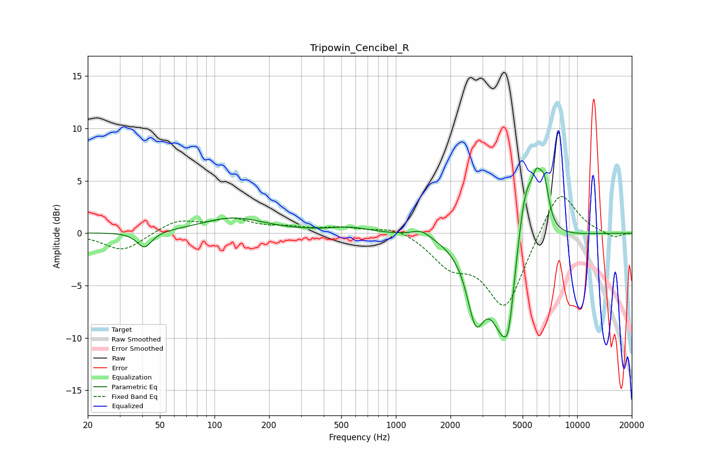

# Tripowin_Cencibel_R
See [usage instructions](https://github.com/jaakkopasanen/AutoEq#usage) for more options and info.

### Parametric EQs
Apply preamp of -6.3 dB when using parametric equalizer.

|   # | Type    |   Fc (Hz) |    Q |   Gain (dB) |
|-----|---------|-----------|------|-------------|
|   1 | Peaking |        41 | 3.53 |        -1.6 |
|   2 | Peaking |       127 | 0.8  |         1.4 |
|   3 | Peaking |       557 | 1.27 |         0.5 |
|   4 | Peaking |      1383 | 2.7  |         0.7 |
|   5 | Peaking |      2755 | 2.93 |        -6.1 |
|   6 | Peaking |      3937 | 1.86 |        -9.4 |
|   7 | Peaking |      4193 | 5.82 |        -2.7 |
|   8 | Peaking |      5174 | 2.74 |         7.1 |
|   9 | Peaking |      5988 | 4.89 |         3.5 |
|  10 | Peaking |      6587 | 5.25 |         3.7 |

### Fixed Band EQs
When using fixed band (also called graphic) equalizer, apply preamp of **-3.6 dB** (if available) and set gains manually with these parameters.

|   # | Type    |   Fc (Hz) |    Q |   Gain (dB) |
|-----|---------|-----------|------|-------------|
|   1 | Peaking |        31 | 1.41 |        -1.7 |
|   2 | Peaking |        62 | 1.41 |         1.2 |
|   3 | Peaking |       125 | 1.41 |         1.2 |
|   4 | Peaking |       250 | 1.41 |         0.4 |
|   5 | Peaking |       500 | 1.41 |         0.5 |
|   6 | Peaking |      1000 | 1.41 |         0.7 |
|   7 | Peaking |      2000 | 1.41 |        -2.6 |
|   8 | Peaking |      4000 | 1.41 |        -7.1 |
|   9 | Peaking |      8000 | 1.41 |         4.6 |
|  10 | Peaking |     16000 | 1.41 |        -0.5 |

### Graphs

