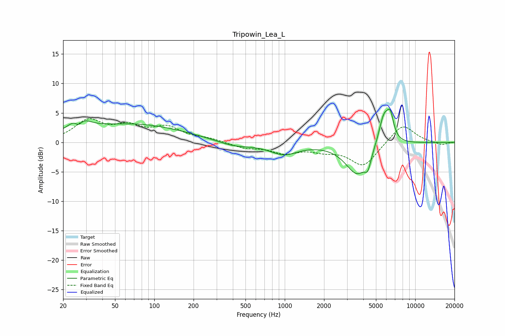

# Tripowin_Lea_L
See [usage instructions](https://github.com/jaakkopasanen/AutoEq#usage) for more options and info.

### Parametric EQs
Apply preamp of -5.7 dB when using parametric equalizer.

|   # | Type    |   Fc (Hz) |    Q |   Gain (dB) |
|-----|---------|-----------|------|-------------|
|   1 | Peaking |        26 | 2.22 |         3.1 |
|   2 | Peaking |        26 | 4.54 |        -1.9 |
|   3 | Peaking |        69 | 0.35 |         3   |
|   4 | Peaking |       408 | 1.06 |        -0.9 |
|   5 | Peaking |       983 | 1.3  |        -1.9 |
|   6 | Peaking |      3223 | 3.24 |         0.1 |
|   7 | Peaking |      3578 | 1.58 |        -5.4 |
|   8 | Peaking |      4332 | 5.92 |        -2.1 |
|   9 | Peaking |      5759 | 3.35 |         5.3 |
|  10 | Peaking |      6449 | 5.46 |         3.5 |

### Fixed Band EQs
When using fixed band (also called graphic) equalizer, apply preamp of **-4.1 dB** (if available) and set gains manually with these parameters.

|   # | Type    |   Fc (Hz) |    Q |   Gain (dB) |
|-----|---------|-----------|------|-------------|
|   1 | Peaking |        31 | 1.41 |         3.5 |
|   2 | Peaking |        62 | 1.41 |         2.3 |
|   3 | Peaking |       125 | 1.41 |         2.3 |
|   4 | Peaking |       250 | 1.41 |         0.6 |
|   5 | Peaking |       500 | 1.41 |        -0.9 |
|   6 | Peaking |      1000 | 1.41 |        -1.6 |
|   7 | Peaking |      2000 | 1.41 |        -1.1 |
|   8 | Peaking |      4000 | 1.41 |        -4   |
|   9 | Peaking |      8000 | 1.41 |         3.2 |
|  10 | Peaking |     16000 | 1.41 |        -0.5 |

### Graphs

