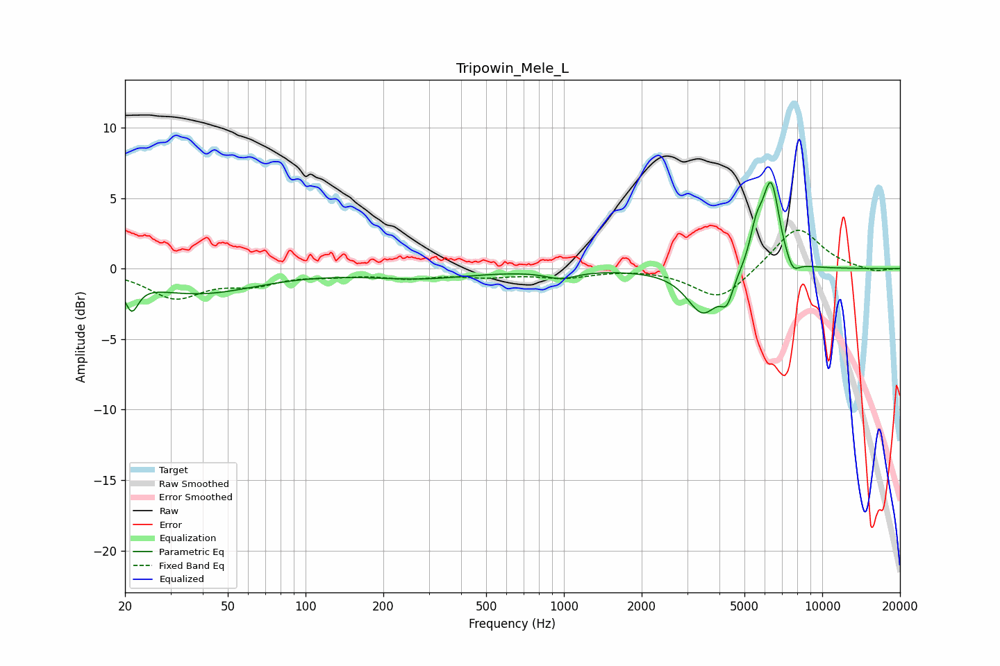

# Tripowin_Mele_L
See [usage instructions](https://github.com/jaakkopasanen/AutoEq#usage) for more options and info.

### Parametric EQs
Apply preamp of -6.2 dB when using parametric equalizer.

|   # | Type    |   Fc (Hz) |    Q |   Gain (dB) |
|-----|---------|-----------|------|-------------|
|   1 | Peaking |        21 | 5.62 |        -2   |
|   2 | Peaking |        38 | 0.62 |        -1.7 |
|   3 | Peaking |       279 | 0.7  |        -0.6 |
|   4 | Peaking |       973 | 2.38 |        -0.5 |
|   5 | Peaking |      3454 | 2.25 |        -3.1 |
|   6 | Peaking |      4276 | 5.81 |        -1.6 |
|   7 | Peaking |      5556 | 5.4  |         2.3 |
|   8 | Peaking |      6171 | 4.53 |         2   |
|   9 | Peaking |      6411 | 4.44 |         4.2 |
|  10 | Peaking |      7689 | 5.3  |        -1   |

### Fixed Band EQs
When using fixed band (also called graphic) equalizer, apply preamp of **-2.8 dB** (if available) and set gains manually with these parameters.

|   # | Type    |   Fc (Hz) |    Q |   Gain (dB) |
|-----|---------|-----------|------|-------------|
|   1 | Peaking |        31 | 1.41 |        -2   |
|   2 | Peaking |        62 | 1.41 |        -0.9 |
|   3 | Peaking |       125 | 1.41 |        -0.3 |
|   4 | Peaking |       250 | 1.41 |        -0.6 |
|   5 | Peaking |       500 | 1.41 |        -0.4 |
|   6 | Peaking |      1000 | 1.41 |        -0.6 |
|   7 | Peaking |      2000 | 1.41 |         0.1 |
|   8 | Peaking |      4000 | 1.41 |        -2.3 |
|   9 | Peaking |      8000 | 1.41 |         3.1 |
|  10 | Peaking |     16000 | 1.41 |        -0.3 |

### Graphs

