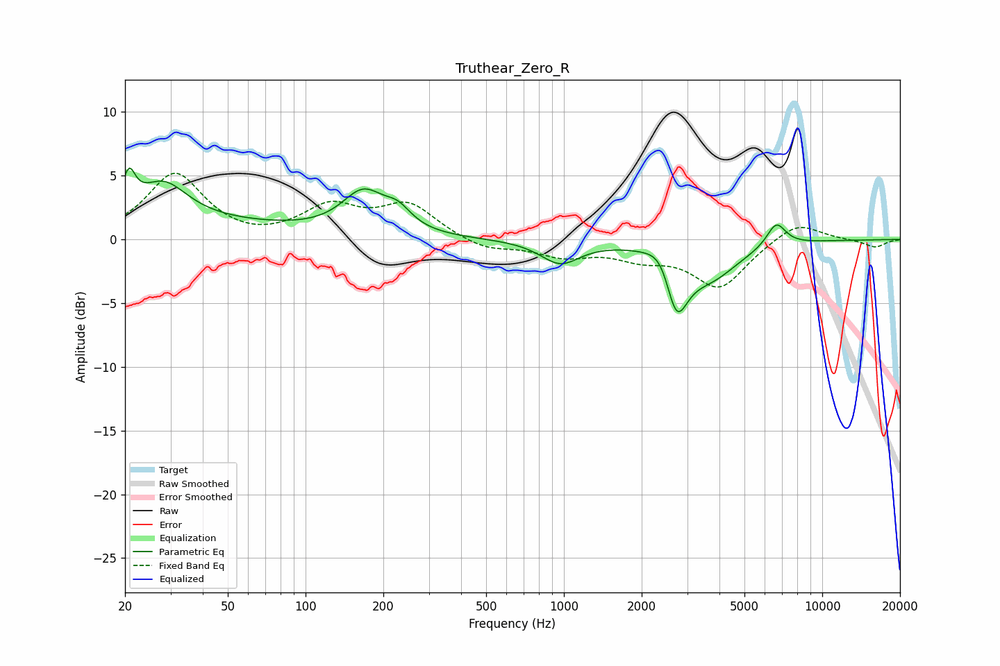

# Truthear_Zero_R
See [usage instructions](https://github.com/jaakkopasanen/AutoEq#usage) for more options and info.

### Parametric EQs
Apply preamp of -5.7 dB when using parametric equalizer.

|   # | Type    |   Fc (Hz) |    Q |   Gain (dB) |
|-----|---------|-----------|------|-------------|
|   1 | Peaking |        21 | 5.92 |         2.6 |
|   2 | Peaking |        22 | 0.22 |         1.4 |
|   3 | Peaking |        28 | 1.54 |         2.9 |
|   4 | Peaking |       168 | 1.7  |         3.2 |
|   5 | Peaking |       228 | 2.71 |         1.3 |
|   6 | Peaking |       968 | 1.87 |        -1.8 |
|   7 | Peaking |      2448 | 2.62 |         2.2 |
|   8 | Peaking |      2716 | 3.17 |        -5.4 |
|   9 | Peaking |      3669 | 1.25 |        -2.7 |
|  10 | Peaking |      6636 | 3.63 |         1.9 |

### Fixed Band EQs
When using fixed band (also called graphic) equalizer, apply preamp of **-5.3 dB** (if available) and set gains manually with these parameters.

|   # | Type    |   Fc (Hz) |    Q |   Gain (dB) |
|-----|---------|-----------|------|-------------|
|   1 | Peaking |        31 | 1.41 |         5.1 |
|   2 | Peaking |        62 | 1.41 |        -0.3 |
|   3 | Peaking |       125 | 1.41 |         2.4 |
|   4 | Peaking |       250 | 1.41 |         2.6 |
|   5 | Peaking |       500 | 1.41 |        -0.9 |
|   6 | Peaking |      1000 | 1.41 |        -1.2 |
|   7 | Peaking |      2000 | 1.41 |        -1.2 |
|   8 | Peaking |      4000 | 1.41 |        -3.7 |
|   9 | Peaking |      8000 | 1.41 |         1.5 |
|  10 | Peaking |     16000 | 1.41 |        -0.6 |

### Graphs

