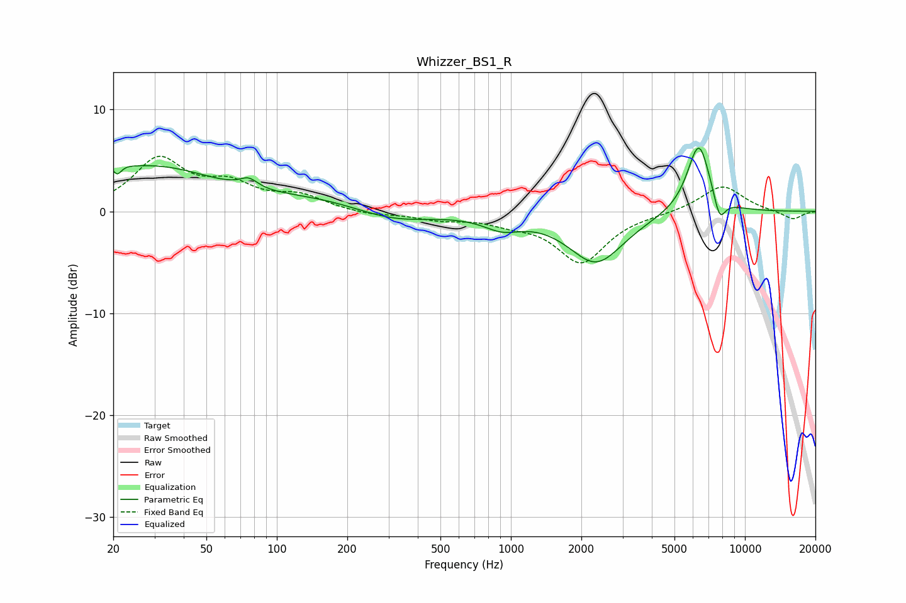

# Whizzer_BS1_R
See [usage instructions](https://github.com/jaakkopasanen/AutoEq#usage) for more options and info.

### Parametric EQs
Apply preamp of -6.3 dB when using parametric equalizer.

|   # | Type    |   Fc (Hz) |    Q |   Gain (dB) |
|-----|---------|-----------|------|-------------|
|   1 | Peaking |        20 | 4.49 |         3.6 |
|   2 | Peaking |        21 | 5.8  |        -3.7 |
|   3 | Peaking |        29 | 0.5  |         4.3 |
|   4 | Peaking |        76 | 3.78 |         0.9 |
|   5 | Peaking |       153 | 0.62 |         1   |
|   6 | Peaking |       313 | 0.83 |        -1.2 |
|   7 | Peaking |       917 | 1.75 |        -1.3 |
|   8 | Peaking |      2315 | 1.19 |        -5   |
|   9 | Peaking |      6351 | 2.73 |         7   |
|  10 | Peaking |      7789 | 5.18 |        -2.5 |

### Fixed Band EQs
When using fixed band (also called graphic) equalizer, apply preamp of **-5.5 dB** (if available) and set gains manually with these parameters.

|   # | Type    |   Fc (Hz) |    Q |   Gain (dB) |
|-----|---------|-----------|------|-------------|
|   1 | Peaking |        31 | 1.41 |         4.9 |
|   2 | Peaking |        62 | 1.41 |         2.2 |
|   3 | Peaking |       125 | 1.41 |         1.4 |
|   4 | Peaking |       250 | 1.41 |        -0.4 |
|   5 | Peaking |       500 | 1.41 |        -0.7 |
|   6 | Peaking |      1000 | 1.41 |        -0.8 |
|   7 | Peaking |      2000 | 1.41 |        -4.9 |
|   8 | Peaking |      4000 | 1.41 |        -0.2 |
|   9 | Peaking |      8000 | 1.41 |         2.6 |
|  10 | Peaking |     16000 | 1.41 |        -0.8 |

### Graphs

