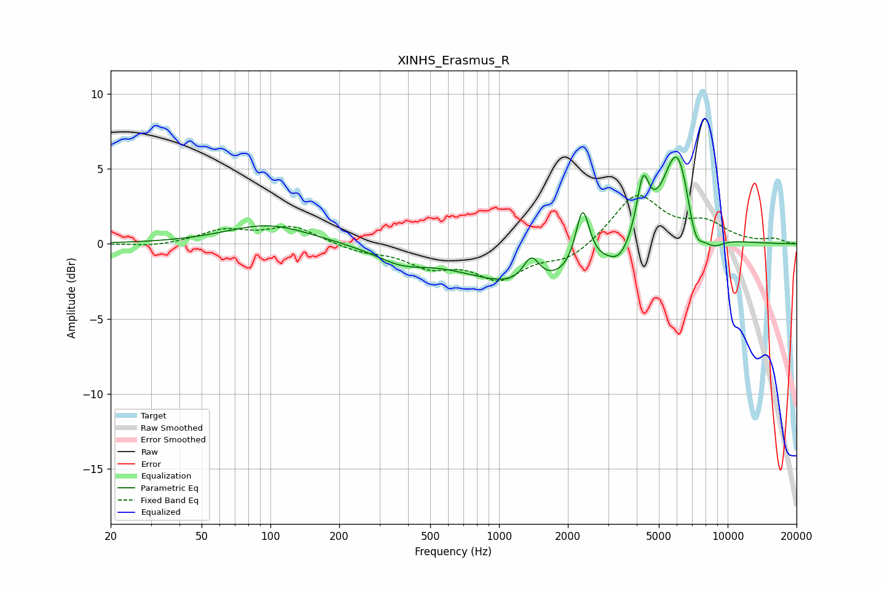

# XINHS_Erasmus_R
See [usage instructions](https://github.com/jaakkopasanen/AutoEq#usage) for more options and info.

### Parametric EQs
Apply preamp of -5.9 dB when using parametric equalizer.

|   # | Type    |   Fc (Hz) |    Q |   Gain (dB) |
|-----|---------|-----------|------|-------------|
|   1 | Peaking |        98 | 0.77 |         1.3 |
|   2 | Peaking |       371 | 1.25 |        -0.9 |
|   3 | Peaking |      1376 | 0.52 |        -2.9 |
|   4 | Peaking |      1385 | 3.92 |         1.8 |
|   5 | Peaking |      2320 | 4.76 |         4   |
|   6 | Peaking |      3366 | 3.23 |        -0.9 |
|   7 | Peaking |      4260 | 5.19 |         3.7 |
|   8 | Peaking |      6039 | 2.04 |         7   |
|   9 | Peaking |      7184 | 3.51 |        -2.7 |
|  10 | Peaking |      8622 | 2.6  |        -0.9 |

### Fixed Band EQs
When using fixed band (also called graphic) equalizer, apply preamp of **-3.3 dB** (if available) and set gains manually with these parameters.

|   # | Type    |   Fc (Hz) |    Q |   Gain (dB) |
|-----|---------|-----------|------|-------------|
|   1 | Peaking |        31 | 1.41 |        -0.2 |
|   2 | Peaking |        62 | 1.41 |         0.9 |
|   3 | Peaking |       125 | 1.41 |         1.1 |
|   4 | Peaking |       250 | 1.41 |        -0.5 |
|   5 | Peaking |       500 | 1.41 |        -1.3 |
|   6 | Peaking |      1000 | 1.41 |        -2.1 |
|   7 | Peaking |      2000 | 1.41 |        -1.1 |
|   8 | Peaking |      4000 | 1.41 |         3.3 |
|   9 | Peaking |      8000 | 1.41 |         1.2 |
|  10 | Peaking |     16000 | 1.41 |         0.3 |

### Graphs

