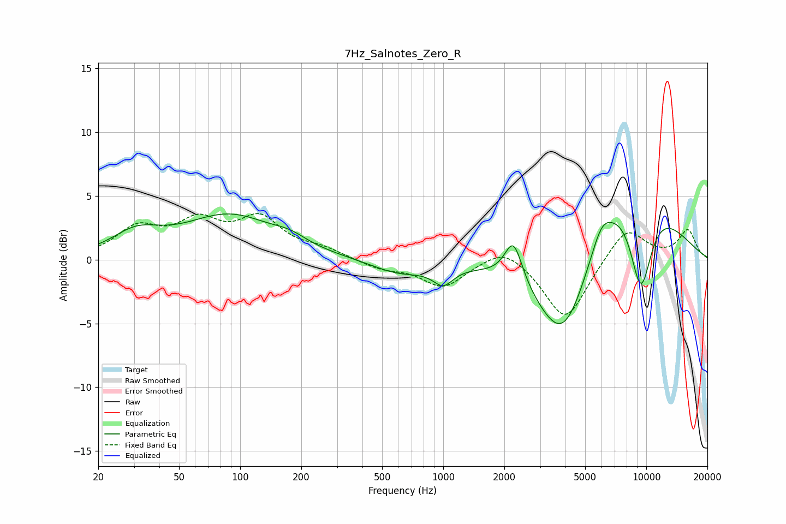

# 7Hz_Salnotes_Zero_R
See [usage instructions](https://github.com/jaakkopasanen/AutoEq#usage) for more options and info.

### Parametric EQs
Apply preamp of -3.7 dB when using parametric equalizer.

|   # | Type    |   Fc (Hz) |    Q |   Gain (dB) |
|-----|---------|-----------|------|-------------|
|   1 | Peaking |        31 | 1.2  |         1.7 |
|   2 | Peaking |        89 | 0.63 |         3.4 |
|   3 | Peaking |       177 | 1.78 |         0.6 |
|   4 | Peaking |       606 | 1.01 |        -1.1 |
|   5 | Peaking |      1000 | 2.86 |        -1.4 |
|   6 | Peaking |      2218 | 3.24 |         3.3 |
|   7 | Peaking |      3917 | 0.99 |        -8.6 |
|   8 | Peaking |      6011 | 2.64 |         1.7 |
|   9 | Peaking |      8090 | 0.57 |         7.6 |
|  10 | Peaking |      9396 | 2.12 |        -7.8 |

### Fixed Band EQs
When using fixed band (also called graphic) equalizer, apply preamp of **-3.7 dB** (if available) and set gains manually with these parameters.

|   # | Type    |   Fc (Hz) |    Q |   Gain (dB) |
|-----|---------|-----------|------|-------------|
|   1 | Peaking |        31 | 1.41 |         2.3 |
|   2 | Peaking |        62 | 1.41 |         2.6 |
|   3 | Peaking |       125 | 1.41 |         2.9 |
|   4 | Peaking |       250 | 1.41 |         0.7 |
|   5 | Peaking |       500 | 1.41 |        -0.7 |
|   6 | Peaking |      1000 | 1.41 |        -2.1 |
|   7 | Peaking |      2000 | 1.41 |         1.3 |
|   8 | Peaking |      4000 | 1.41 |        -4.8 |
|   9 | Peaking |      8000 | 1.41 |         2.6 |
|  10 | Peaking |     16000 | 1.41 |         2.3 |

### Graphs

