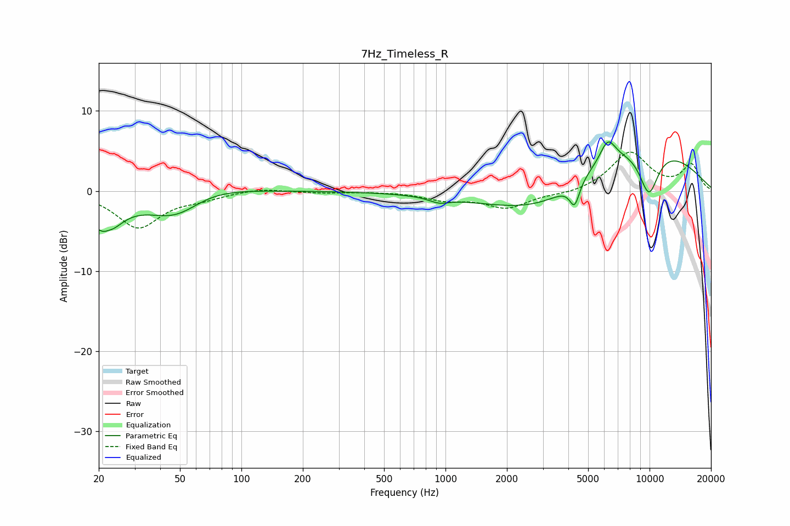

# 7Hz_Timeless_R
See [usage instructions](https://github.com/jaakkopasanen/AutoEq#usage) for more options and info.

### Parametric EQs
Apply preamp of -6.2 dB when using parametric equalizer.

|   # | Type    |   Fc (Hz) |    Q |   Gain (dB) |
|-----|---------|-----------|------|-------------|
|   1 | Peaking |        21 | 1.89 |        -4.7 |
|   2 | Peaking |        22 | 5.91 |         0.4 |
|   3 | Peaking |        49 | 0.92 |        -5.1 |
|   4 | Peaking |        59 | 0.78 |         2.9 |
|   5 | Peaking |       929 | 2.88 |        -0.7 |
|   6 | Peaking |      3194 | 0.48 |        -7.2 |
|   7 | Peaking |      4293 | 5.78 |        -2.9 |
|   8 | Peaking |      6243 | 3.56 |         2.8 |
|   9 | Peaking |      6676 | 0.32 |         8.6 |
|  10 | Peaking |      9922 | 2.47 |        -5.8 |

### Fixed Band EQs
When using fixed band (also called graphic) equalizer, apply preamp of **-5.0 dB** (if available) and set gains manually with these parameters.

|   # | Type    |   Fc (Hz) |    Q |   Gain (dB) |
|-----|---------|-----------|------|-------------|
|   1 | Peaking |        31 | 1.41 |        -4.5 |
|   2 | Peaking |        62 | 1.41 |        -0.7 |
|   3 | Peaking |       125 | 1.41 |         0.4 |
|   4 | Peaking |       250 | 1.41 |        -0.2 |
|   5 | Peaking |       500 | 1.41 |        -0   |
|   6 | Peaking |      1000 | 1.41 |        -1   |
|   7 | Peaking |      2000 | 1.41 |        -2   |
|   8 | Peaking |      4000 | 1.41 |        -0.4 |
|   9 | Peaking |      8000 | 1.41 |         4.8 |
|  10 | Peaking |     16000 | 1.41 |         3.2 |

### Graphs

