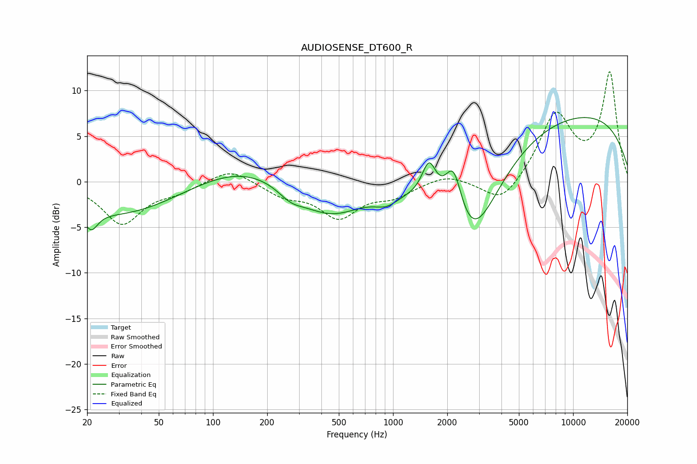

# AUDIOSENSE_DT600_R
See [usage instructions](https://github.com/jaakkopasanen/AutoEq#usage) for more options and info.

### Parametric EQs
Apply preamp of -7.1 dB when using parametric equalizer.

|   # | Type    |   Fc (Hz) |    Q |   Gain (dB) |
|-----|---------|-----------|------|-------------|
|   1 | Peaking |        21 | 3.87 |        -2.2 |
|   2 | Peaking |        31 | 0.44 |        -3.6 |
|   3 | Peaking |       147 | 0.53 |         2.2 |
|   4 | Peaking |       270 | 1.97 |        -1.2 |
|   5 | Peaking |       445 | 0.78 |        -3.8 |
|   6 | Peaking |       919 | 2.1  |        -1.2 |
|   7 | Peaking |      1584 | 3.61 |         3.9 |
|   8 | Peaking |      2169 | 2.91 |         5.7 |
|   9 | Peaking |      2721 | 0.84 |       -11.6 |
|  10 | Peaking |      8461 | 0.2  |         8   |

### Fixed Band EQs
When using fixed band (also called graphic) equalizer, apply preamp of **-12.2 dB** (if available) and set gains manually with these parameters.

|   # | Type    |   Fc (Hz) |    Q |   Gain (dB) |
|-----|---------|-----------|------|-------------|
|   1 | Peaking |        31 | 1.41 |        -4.6 |
|   2 | Peaking |        62 | 1.41 |        -0.9 |
|   3 | Peaking |       125 | 1.41 |         1.6 |
|   4 | Peaking |       250 | 1.41 |        -1.4 |
|   5 | Peaking |       500 | 1.41 |        -3.7 |
|   6 | Peaking |      1000 | 1.41 |        -1.4 |
|   7 | Peaking |      2000 | 1.41 |         0.9 |
|   8 | Peaking |      4000 | 1.41 |        -2.7 |
|   9 | Peaking |      8000 | 1.41 |         7.2 |
|  10 | Peaking |     16000 | 1.41 |        11.8 |

### Graphs

