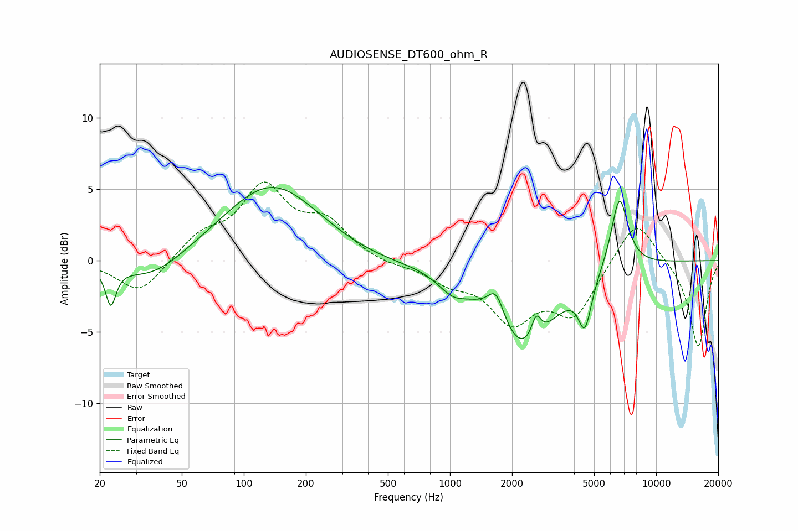

# AUDIOSENSE_DT600_ohm_R
See [usage instructions](https://github.com/jaakkopasanen/AutoEq#usage) for more options and info.

### Parametric EQs
Apply preamp of -5.2 dB when using parametric equalizer.

|   # | Type    |   Fc (Hz) |    Q |   Gain (dB) |
|-----|---------|-----------|------|-------------|
|   1 | Peaking |        23 | 5.76 |        -2.6 |
|   2 | Peaking |        36 | 0.93 |        -1.6 |
|   3 | Peaking |       137 | 0.61 |         5.4 |
|   4 | Peaking |       414 | 0.72 |        -0.4 |
|   5 | Peaking |      1027 | 2    |        -1.1 |
|   6 | Peaking |      1672 | 3.37 |         2.2 |
|   7 | Peaking |      2269 | 0.94 |        -6.2 |
|   8 | Peaking |      2619 | 6    |         1.7 |
|   9 | Peaking |      4515 | 4.35 |        -3.3 |
|  10 | Peaking |      6636 | 3.32 |         5.2 |

### Fixed Band EQs
When using fixed band (also called graphic) equalizer, apply preamp of **-5.6 dB** (if available) and set gains manually with these parameters.

|   # | Type    |   Fc (Hz) |    Q |   Gain (dB) |
|-----|---------|-----------|------|-------------|
|   1 | Peaking |        31 | 1.41 |        -2.4 |
|   2 | Peaking |        62 | 1.41 |         1.6 |
|   3 | Peaking |       125 | 1.41 |         4.9 |
|   4 | Peaking |       250 | 1.41 |         2.4 |
|   5 | Peaking |       500 | 1.41 |        -0.3 |
|   6 | Peaking |      1000 | 1.41 |        -1.2 |
|   7 | Peaking |      2000 | 1.41 |        -3.9 |
|   8 | Peaking |      4000 | 1.41 |        -3.6 |
|   9 | Peaking |      8000 | 1.41 |         3.2 |
|  10 | Peaking |     16000 | 1.41 |        -6.1 |

### Graphs

