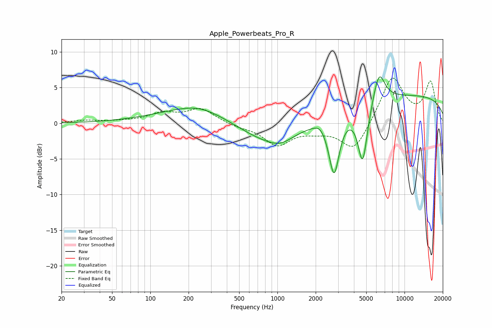

# Apple_Powerbeats_Pro_R
See [usage instructions](https://github.com/jaakkopasanen/AutoEq#usage) for more options and info.

### Parametric EQs
Apply preamp of -6.6 dB when using parametric equalizer.

|   # | Type    |   Fc (Hz) |    Q |   Gain (dB) |
|-----|---------|-----------|------|-------------|
|   1 | Peaking |       237 | 0.91 |         0.8 |
|   2 | Peaking |       253 | 0.4  |         2   |
|   3 | Peaking |       851 | 0.55 |        -3.4 |
|   4 | Peaking |      1054 | 1.65 |        -0.8 |
|   5 | Peaking |      2041 | 3.09 |         0.2 |
|   6 | Peaking |      2174 | 3.95 |         0.5 |
|   7 | Peaking |      2792 | 3.37 |        -8.4 |
|   8 | Peaking |      4684 | 3.61 |        -8.4 |
|   9 | Peaking |      6295 | 3.01 |         4.4 |
|  10 | Peaking |     10000 | 0.18 |         3.9 |

### Fixed Band EQs
When using fixed band (also called graphic) equalizer, apply preamp of **-6.4 dB** (if available) and set gains manually with these parameters.

|   # | Type    |   Fc (Hz) |    Q |   Gain (dB) |
|-----|---------|-----------|------|-------------|
|   1 | Peaking |        31 | 1.41 |         0.3 |
|   2 | Peaking |        62 | 1.41 |         0.2 |
|   3 | Peaking |       125 | 1.41 |         1.3 |
|   4 | Peaking |       250 | 1.41 |         2   |
|   5 | Peaking |       500 | 1.41 |        -0.4 |
|   6 | Peaking |      1000 | 1.41 |        -2.9 |
|   7 | Peaking |      2000 | 1.41 |        -0.8 |
|   8 | Peaking |      4000 | 1.41 |        -4   |
|   9 | Peaking |      8000 | 1.41 |         6.6 |
|  10 | Peaking |     16000 | 1.41 |         5.6 |

### Graphs

