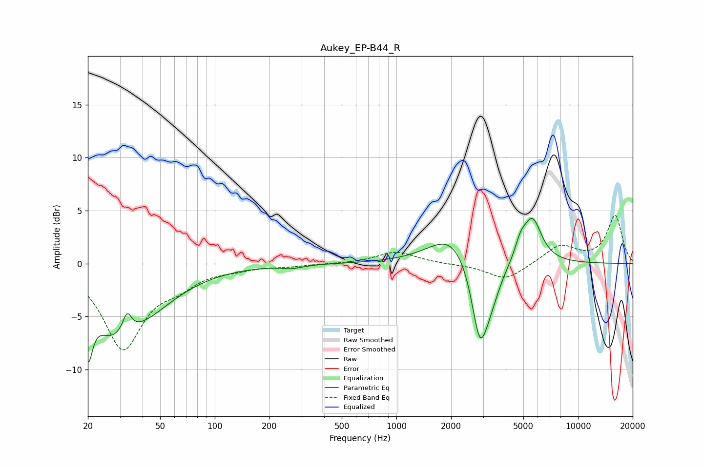

# Aukey_EP-B44_R
See [usage instructions](https://github.com/jaakkopasanen/AutoEq#usage) for more options and info.

### Parametric EQs
Apply preamp of -4.4 dB when using parametric equalizer.

|   # | Type    |   Fc (Hz) |    Q |   Gain (dB) |
|-----|---------|-----------|------|-------------|
|   1 | Peaking |        20 | 5.64 |        -5.2 |
|   2 | Peaking |        26 | 1.69 |        -2.3 |
|   3 | Peaking |        33 | 5.98 |         1.8 |
|   4 | Peaking |        36 | 0.69 |        -5   |
|   5 | Peaking |       265 | 2.39 |        -0.3 |
|   6 | Peaking |      2037 | 1.13 |         3   |
|   7 | Peaking |      2877 | 3.06 |        -7.1 |
|   8 | Peaking |      3288 | 2.31 |        -2.7 |
|   9 | Peaking |      4821 | 4.55 |         1.3 |
|  10 | Peaking |      5600 | 2.68 |         4.2 |

### Fixed Band EQs
When using fixed band (also called graphic) equalizer, apply preamp of **-4.6 dB** (if available) and set gains manually with these parameters.

|   # | Type    |   Fc (Hz) |    Q |   Gain (dB) |
|-----|---------|-----------|------|-------------|
|   1 | Peaking |        31 | 1.41 |        -7.9 |
|   2 | Peaking |        62 | 1.41 |        -1.5 |
|   3 | Peaking |       125 | 1.41 |        -0.4 |
|   4 | Peaking |       250 | 1.41 |        -0.2 |
|   5 | Peaking |       500 | 1.41 |        -0   |
|   6 | Peaking |      1000 | 1.41 |         1.1 |
|   7 | Peaking |      2000 | 1.41 |        -0.1 |
|   8 | Peaking |      4000 | 1.41 |        -1.6 |
|   9 | Peaking |      8000 | 1.41 |         1.7 |
|  10 | Peaking |     16000 | 1.41 |         4.5 |

### Graphs

