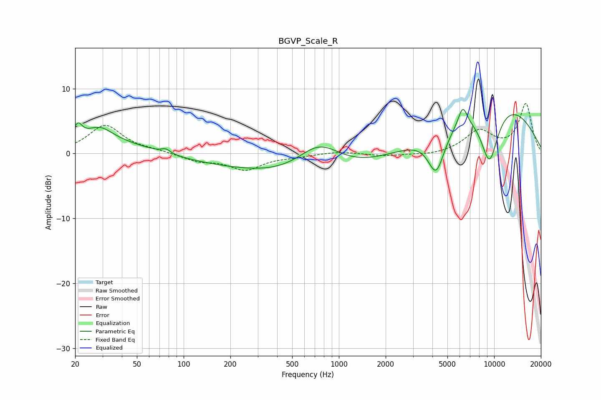

# BGVP_Scale_R
See [usage instructions](https://github.com/jaakkopasanen/AutoEq#usage) for more options and info.

### Parametric EQs
Apply preamp of -6.9 dB when using parametric equalizer.

|   # | Type    |   Fc (Hz) |    Q |   Gain (dB) |
|-----|---------|-----------|------|-------------|
|   1 | Peaking |        21 | 5.51 |         2   |
|   2 | Peaking |        29 | 1.75 |         2   |
|   3 | Peaking |        77 | 5    |         0.7 |
|   4 | Peaking |        78 | 0.2  |         3.9 |
|   5 | Peaking |       292 | 0.18 |        -5.8 |
|   6 | Peaking |       748 | 0.98 |         4.9 |
|   7 | Peaking |      4232 | 2.59 |        -6.4 |
|   8 | Peaking |      6275 | 4.67 |         3   |
|   9 | Peaking |      9325 | 2.04 |        -9.2 |
|  10 | Peaking |     10000 | 0.37 |         8.6 |

### Fixed Band EQs
When using fixed band (also called graphic) equalizer, apply preamp of **-7.8 dB** (if available) and set gains manually with these parameters.

|   # | Type    |   Fc (Hz) |    Q |   Gain (dB) |
|-----|---------|-----------|------|-------------|
|   1 | Peaking |        31 | 1.41 |         4.3 |
|   2 | Peaking |        62 | 1.41 |         0.4 |
|   3 | Peaking |       125 | 1.41 |        -1.1 |
|   4 | Peaking |       250 | 1.41 |        -2.4 |
|   5 | Peaking |       500 | 1.41 |        -0.4 |
|   6 | Peaking |      1000 | 1.41 |         0.3 |
|   7 | Peaking |      2000 | 1.41 |        -0.4 |
|   8 | Peaking |      4000 | 1.41 |        -0.3 |
|   9 | Peaking |      8000 | 1.41 |         3.4 |
|  10 | Peaking |     16000 | 1.41 |         7.6 |

### Graphs

