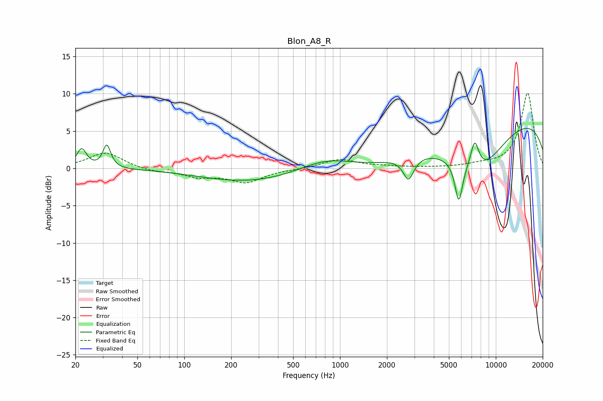

# Blon_A8_R
See [usage instructions](https://github.com/jaakkopasanen/AutoEq#usage) for more options and info.

### Parametric EQs
Apply preamp of -5.4 dB when using parametric equalizer.

|   # | Type    |   Fc (Hz) |    Q |   Gain (dB) |
|-----|---------|-----------|------|-------------|
|   1 | Peaking |        22 | 4.53 |         2.5 |
|   2 | Peaking |        32 | 5.84 |         3.1 |
|   3 | Peaking |       760 | 0.38 |         3.8 |
|   4 | Peaking |       780 | 0.23 |        -5.3 |
|   5 | Peaking |       816 | 0.83 |         1.7 |
|   6 | Peaking |      2751 | 4.17 |        -3   |
|   7 | Peaking |      5784 | 5.63 |        -5.3 |
|   8 | Peaking |      7317 | 4.69 |         4   |
|   9 | Peaking |      7678 | 0.74 |        -6.8 |
|  10 | Peaking |     10000 | 0.18 |         7.5 |

### Fixed Band EQs
When using fixed band (also called graphic) equalizer, apply preamp of **-10.2 dB** (if available) and set gains manually with these parameters.

|   # | Type    |   Fc (Hz) |    Q |   Gain (dB) |
|-----|---------|-----------|------|-------------|
|   1 | Peaking |        31 | 1.41 |         2.2 |
|   2 | Peaking |        62 | 1.41 |        -0.4 |
|   3 | Peaking |       125 | 1.41 |        -1   |
|   4 | Peaking |       250 | 1.41 |        -1.8 |
|   5 | Peaking |       500 | 1.41 |        -0.1 |
|   6 | Peaking |      1000 | 1.41 |         1.2 |
|   7 | Peaking |      2000 | 1.41 |         0.2 |
|   8 | Peaking |      4000 | 1.41 |         0   |
|   9 | Peaking |      8000 | 1.41 |         0.4 |
|  10 | Peaking |     16000 | 1.41 |        10.1 |

### Graphs

