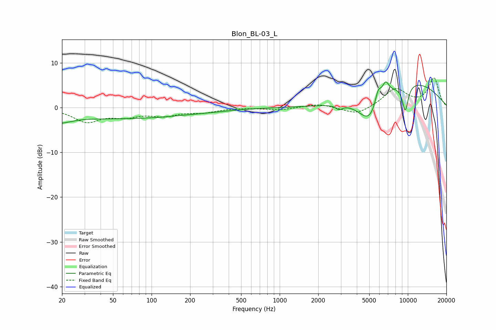

# Blon_BL-03_L
See [usage instructions](https://github.com/jaakkopasanen/AutoEq#usage) for more options and info.

### Parametric EQs
Apply preamp of -5.9 dB when using parametric equalizer.

|   # | Type    |   Fc (Hz) |    Q |   Gain (dB) |
|-----|---------|-----------|------|-------------|
|   1 | Peaking |        20 | 2.1  |        -2.7 |
|   2 | Peaking |        21 | 2.93 |         1.1 |
|   3 | Peaking |        56 | 0.24 |        -2.4 |
|   4 | Peaking |       316 | 1.23 |        -0.1 |
|   5 | Peaking |      2906 | 6    |        -1   |
|   6 | Peaking |      5039 | 1.55 |        -6.3 |
|   7 | Peaking |      5860 | 5.63 |         3.4 |
|   8 | Peaking |      6702 | 4.82 |         3.2 |
|   9 | Peaking |      9550 | 5.28 |        -5.9 |
|  10 | Peaking |     10000 | 0.39 |         6   |

### Fixed Band EQs
When using fixed band (also called graphic) equalizer, apply preamp of **-6.7 dB** (if available) and set gains manually with these parameters.

|   # | Type    |   Fc (Hz) |    Q |   Gain (dB) |
|-----|---------|-----------|------|-------------|
|   1 | Peaking |        31 | 1.41 |        -3   |
|   2 | Peaking |        62 | 1.41 |        -1.6 |
|   3 | Peaking |       125 | 1.41 |        -1.5 |
|   4 | Peaking |       250 | 1.41 |        -0.9 |
|   5 | Peaking |       500 | 1.41 |         0   |
|   6 | Peaking |      1000 | 1.41 |        -0.5 |
|   7 | Peaking |      2000 | 1.41 |         0.9 |
|   8 | Peaking |      4000 | 1.41 |        -1.7 |
|   9 | Peaking |      8000 | 1.41 |         4.1 |
|  10 | Peaking |     16000 | 1.41 |         6.5 |

### Graphs

