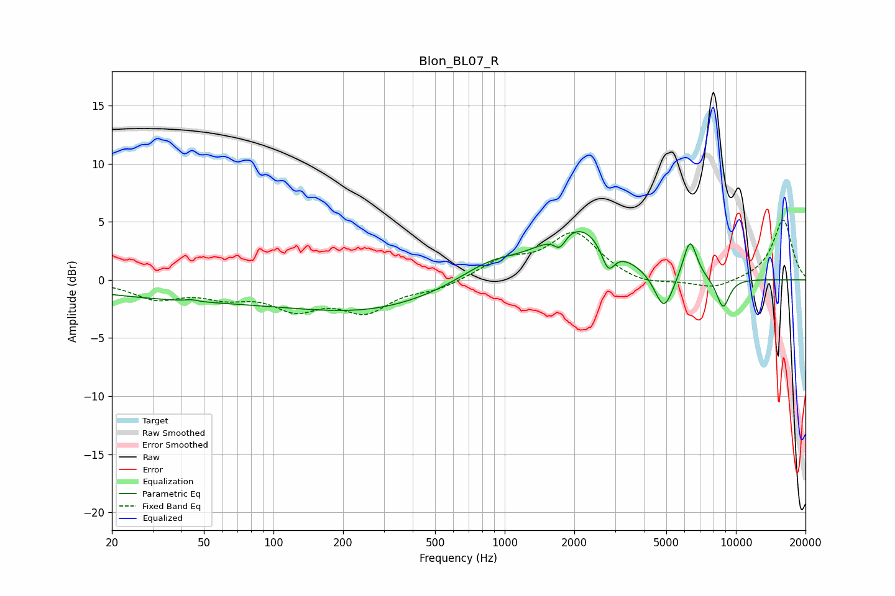

# Blon_BL07_R
See [usage instructions](https://github.com/jaakkopasanen/AutoEq#usage) for more options and info.

### Parametric EQs
Apply preamp of -4.2 dB when using parametric equalizer.

|   # | Type    |   Fc (Hz) |    Q |   Gain (dB) |
|-----|---------|-----------|------|-------------|
|   1 | Peaking |        44 | 5.96 |         0.1 |
|   2 | Peaking |        80 | 0.18 |        -1.8 |
|   3 | Peaking |       283 | 0.48 |        -1.3 |
|   4 | Peaking |       855 | 1.07 |         1.5 |
|   5 | Peaking |      1733 | 5.32 |        -1.3 |
|   6 | Peaking |      2080 | 0.94 |         4.6 |
|   7 | Peaking |      2802 | 4.9  |        -2.2 |
|   8 | Peaking |      4883 | 3.36 |        -3.4 |
|   9 | Peaking |      6333 | 4.55 |         3.5 |
|  10 | Peaking |      8797 | 4.43 |        -2.6 |

### Fixed Band EQs
When using fixed band (also called graphic) equalizer, apply preamp of **-5.2 dB** (if available) and set gains manually with these parameters.

|   # | Type    |   Fc (Hz) |    Q |   Gain (dB) |
|-----|---------|-----------|------|-------------|
|   1 | Peaking |        31 | 1.41 |        -1.5 |
|   2 | Peaking |        62 | 1.41 |        -1.2 |
|   3 | Peaking |       125 | 1.41 |        -2.2 |
|   4 | Peaking |       250 | 1.41 |        -2.5 |
|   5 | Peaking |       500 | 1.41 |        -0.7 |
|   6 | Peaking |      1000 | 1.41 |         1.5 |
|   7 | Peaking |      2000 | 1.41 |         3.9 |
|   8 | Peaking |      4000 | 1.41 |        -0.6 |
|   9 | Peaking |      8000 | 1.41 |        -0.8 |
|  10 | Peaking |     16000 | 1.41 |         5.2 |

### Graphs

