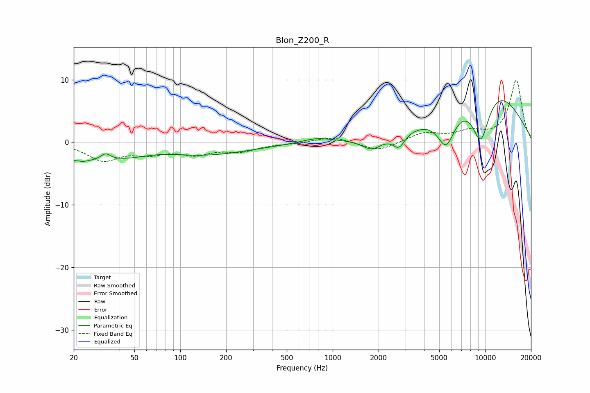

# Blon_Z200_R
See [usage instructions](https://github.com/jaakkopasanen/AutoEq#usage) for more options and info.

### Parametric EQs
Apply preamp of -6.7 dB when using parametric equalizer.

|   # | Type    |   Fc (Hz) |    Q |   Gain (dB) |
|-----|---------|-----------|------|-------------|
|   1 | Peaking |        23 | 5.22 |        -0.2 |
|   2 | Peaking |        32 | 4.3  |         1.1 |
|   3 | Peaking |        45 | 0.18 |        -3.4 |
|   4 | Peaking |        75 | 0.79 |         1.3 |
|   5 | Peaking |       786 | 1.42 |         0.8 |
|   6 | Peaking |      1806 | 2.16 |        -1.9 |
|   7 | Peaking |      2720 | 3.56 |        -2.3 |
|   8 | Peaking |      5551 | 2.36 |        -5.6 |
|   9 | Peaking |      9361 | 1.98 |        -8.8 |
|  10 | Peaking |     10000 | 0.44 |        10   |

### Fixed Band EQs
When using fixed band (also called graphic) equalizer, apply preamp of **-10.0 dB** (if available) and set gains manually with these parameters.

|   # | Type    |   Fc (Hz) |    Q |   Gain (dB) |
|-----|---------|-----------|------|-------------|
|   1 | Peaking |        31 | 1.41 |        -2.7 |
|   2 | Peaking |        62 | 1.41 |        -1.4 |
|   3 | Peaking |       125 | 1.41 |        -1.7 |
|   4 | Peaking |       250 | 1.41 |        -1.3 |
|   5 | Peaking |       500 | 1.41 |        -0.2 |
|   6 | Peaking |      1000 | 1.41 |         0.9 |
|   7 | Peaking |      2000 | 1.41 |        -1.5 |
|   8 | Peaking |      4000 | 1.41 |         1.4 |
|   9 | Peaking |      8000 | 1.41 |         1.5 |
|  10 | Peaking |     16000 | 1.41 |         9.9 |

### Graphs

