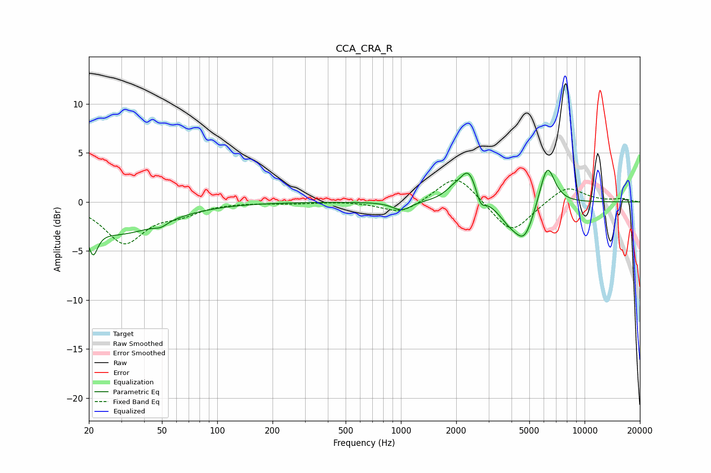

# CCA_CRA_R
See [usage instructions](https://github.com/jaakkopasanen/AutoEq#usage) for more options and info.

### Parametric EQs
Apply preamp of -3.3 dB when using parametric equalizer.

|   # | Type    |   Fc (Hz) |    Q |   Gain (dB) |
|-----|---------|-----------|------|-------------|
|   1 | Peaking |        21 | 5.65 |        -2.7 |
|   2 | Peaking |        29 | 0.62 |        -3.1 |
|   3 | Peaking |        49 | 4    |        -0.5 |
|   4 | Peaking |      1006 | 2.89 |        -0.9 |
|   5 | Peaking |      1943 | 2.74 |         0.9 |
|   6 | Peaking |      2341 | 3.04 |         3.1 |
|   7 | Peaking |      2715 | 6    |        -1.4 |
|   8 | Peaking |      3887 | 2.27 |        -1.5 |
|   9 | Peaking |      4706 | 2.56 |        -3.5 |
|  10 | Peaking |      6256 | 3.27 |         4.3 |

### Fixed Band EQs
When using fixed band (also called graphic) equalizer, apply preamp of **-2.3 dB** (if available) and set gains manually with these parameters.

|   # | Type    |   Fc (Hz) |    Q |   Gain (dB) |
|-----|---------|-----------|------|-------------|
|   1 | Peaking |        31 | 1.41 |        -4.1 |
|   2 | Peaking |        62 | 1.41 |        -1   |
|   3 | Peaking |       125 | 1.41 |         0   |
|   4 | Peaking |       250 | 1.41 |        -0.2 |
|   5 | Peaking |       500 | 1.41 |         0.1 |
|   6 | Peaking |      1000 | 1.41 |        -1.3 |
|   7 | Peaking |      2000 | 1.41 |         2.9 |
|   8 | Peaking |      4000 | 1.41 |        -3.3 |
|   9 | Peaking |      8000 | 1.41 |         1.7 |
|  10 | Peaking |     16000 | 1.41 |         0.3 |

### Graphs

