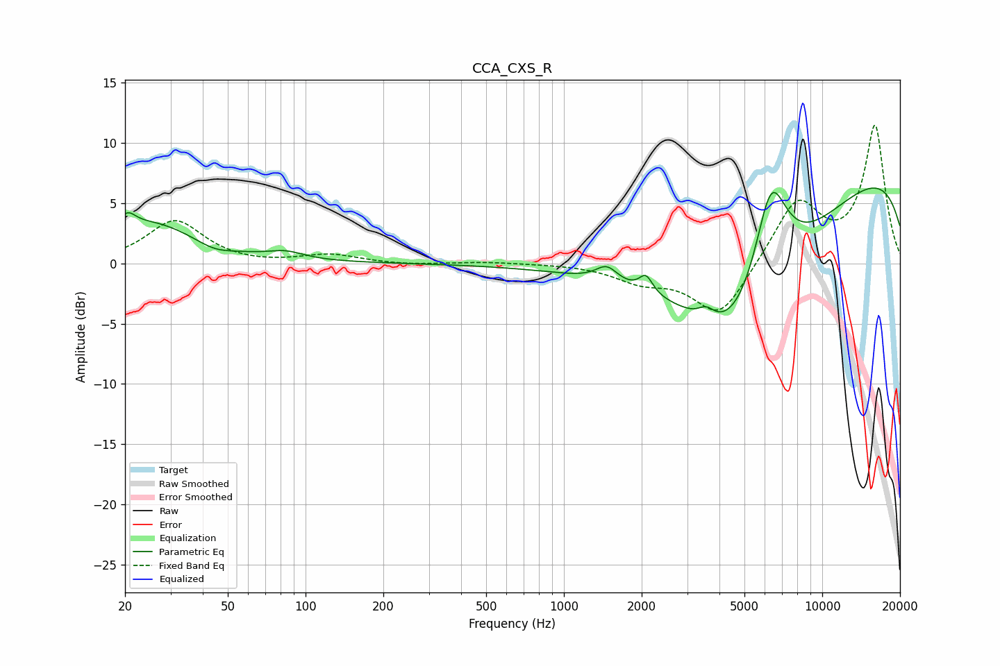

# CCA_CXS_R
See [usage instructions](https://github.com/jaakkopasanen/AutoEq#usage) for more options and info.

### Parametric EQs
Apply preamp of -6.4 dB when using parametric equalizer.

|   # | Type    |   Fc (Hz) |    Q |   Gain (dB) |
|-----|---------|-----------|------|-------------|
|   1 | Peaking |        20 | 4.77 |         1.1 |
|   2 | Peaking |        25 | 0.73 |         3.4 |
|   3 | Peaking |        44 | 1.96 |        -0.7 |
|   4 | Peaking |        84 | 2.12 |         0.6 |
|   5 | Peaking |      1466 | 3.32 |         1.3 |
|   6 | Peaking |      2078 | 5.48 |         1.4 |
|   7 | Peaking |      3559 | 4.54 |         0.9 |
|   8 | Peaking |      4697 | 0.5  |       -14.5 |
|   9 | Peaking |      6317 | 1.98 |         9.4 |
|  10 | Peaking |     10000 | 0.18 |         9.4 |

### Fixed Band EQs
When using fixed band (also called graphic) equalizer, apply preamp of **-11.6 dB** (if available) and set gains manually with these parameters.

|   # | Type    |   Fc (Hz) |    Q |   Gain (dB) |
|-----|---------|-----------|------|-------------|
|   1 | Peaking |        31 | 1.41 |         3.5 |
|   2 | Peaking |        62 | 1.41 |        -0.1 |
|   3 | Peaking |       125 | 1.41 |         0.7 |
|   4 | Peaking |       250 | 1.41 |        -0.1 |
|   5 | Peaking |       500 | 1.41 |         0.1 |
|   6 | Peaking |      1000 | 1.41 |         0   |
|   7 | Peaking |      2000 | 1.41 |        -1.3 |
|   8 | Peaking |      4000 | 1.41 |        -4.5 |
|   9 | Peaking |      8000 | 1.41 |         5.2 |
|  10 | Peaking |     16000 | 1.41 |        11.3 |

### Graphs

