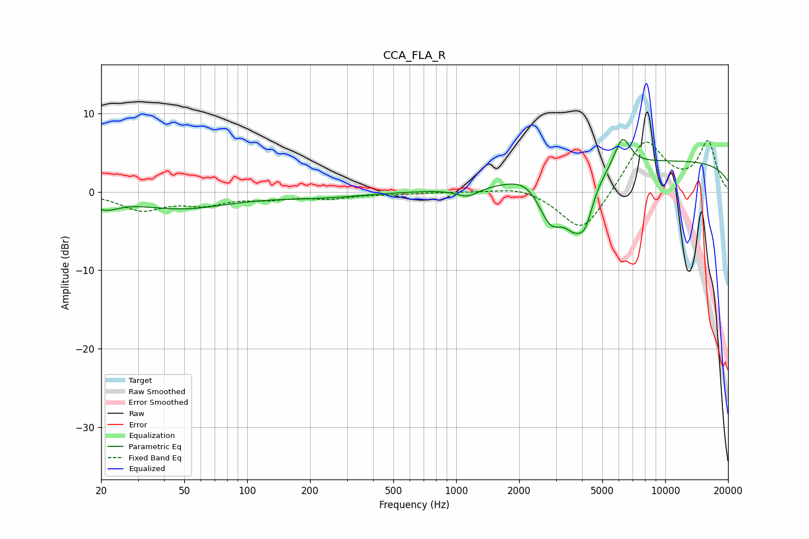

# CCA_FLA_R
See [usage instructions](https://github.com/jaakkopasanen/AutoEq#usage) for more options and info.

### Parametric EQs
Apply preamp of -6.7 dB when using parametric equalizer.

|   # | Type    |   Fc (Hz) |    Q |   Gain (dB) |
|-----|---------|-----------|------|-------------|
|   1 | Peaking |        21 | 2.15 |        -1.5 |
|   2 | Peaking |        49 | 0.62 |        -2   |
|   3 | Peaking |       222 | 0.66 |        -0.6 |
|   4 | Peaking |      1132 | 2.62 |        -1.1 |
|   5 | Peaking |      2259 | 1.57 |         1.8 |
|   6 | Peaking |      2829 | 2.05 |        -6.4 |
|   7 | Peaking |      3645 | 2.9  |        -3.6 |
|   8 | Peaking |      4142 | 3.48 |        -4.5 |
|   9 | Peaking |      6245 | 3.6  |         3.9 |
|  10 | Peaking |     10000 | 0.18 |         4   |

### Fixed Band EQs
When using fixed band (also called graphic) equalizer, apply preamp of **-6.6 dB** (if available) and set gains manually with these parameters.

|   # | Type    |   Fc (Hz) |    Q |   Gain (dB) |
|-----|---------|-----------|------|-------------|
|   1 | Peaking |        31 | 1.41 |        -2.2 |
|   2 | Peaking |        62 | 1.41 |        -1.4 |
|   3 | Peaking |       125 | 1.41 |        -0.7 |
|   4 | Peaking |       250 | 1.41 |        -0.7 |
|   5 | Peaking |       500 | 1.41 |        -0.2 |
|   6 | Peaking |      1000 | 1.41 |         0   |
|   7 | Peaking |      2000 | 1.41 |         0.8 |
|   8 | Peaking |      4000 | 1.41 |        -5.5 |
|   9 | Peaking |      8000 | 1.41 |         6.7 |
|  10 | Peaking |     16000 | 1.41 |         6.2 |

### Graphs

