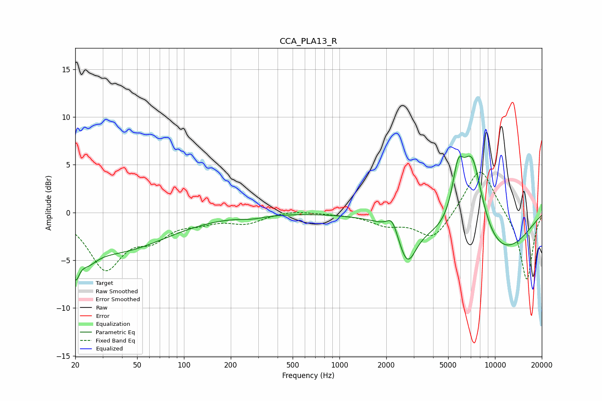

# CCA_PLA13_R
See [usage instructions](https://github.com/jaakkopasanen/AutoEq#usage) for more options and info.

### Parametric EQs
Apply preamp of -6.0 dB when using parametric equalizer.

|   # | Type    |   Fc (Hz) |    Q |   Gain (dB) |
|-----|---------|-----------|------|-------------|
|   1 | Peaking |        20 | 5.66 |        -3.1 |
|   2 | Peaking |        24 | 2.21 |        -1.6 |
|   3 | Peaking |        24 | 2.85 |        -0.1 |
|   4 | Peaking |        37 | 0.44 |        -3.9 |
|   5 | Peaking |       275 | 1.77 |        -0.3 |
|   6 | Peaking |      2184 | 4.14 |         1.6 |
|   7 | Peaking |      2731 | 2.52 |        -4   |
|   8 | Peaking |      5778 | 3.7  |         4.6 |
|   9 | Peaking |      7114 | 1.66 |        10.5 |
|  10 | Peaking |      8560 | 0.44 |        -6.1 |

### Fixed Band EQs
When using fixed band (also called graphic) equalizer, apply preamp of **-4.3 dB** (if available) and set gains manually with these parameters.

|   # | Type    |   Fc (Hz) |    Q |   Gain (dB) |
|-----|---------|-----------|------|-------------|
|   1 | Peaking |        31 | 1.41 |        -5.7 |
|   2 | Peaking |        62 | 1.41 |        -2.2 |
|   3 | Peaking |       125 | 1.41 |        -0.7 |
|   4 | Peaking |       250 | 1.41 |        -1   |
|   5 | Peaking |       500 | 1.41 |         0.3 |
|   6 | Peaking |      1000 | 1.41 |        -0.1 |
|   7 | Peaking |      2000 | 1.41 |        -1.1 |
|   8 | Peaking |      4000 | 1.41 |        -2.8 |
|   9 | Peaking |      8000 | 1.41 |         5.1 |
|  10 | Peaking |     16000 | 1.41 |        -7.2 |

### Graphs

