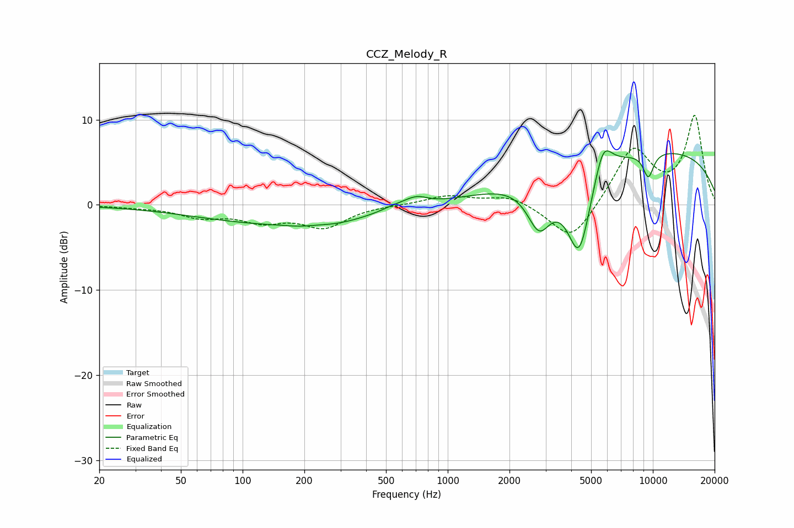

# CCZ_Melody_R
See [usage instructions](https://github.com/jaakkopasanen/AutoEq#usage) for more options and info.

### Parametric EQs
Apply preamp of -6.5 dB when using parametric equalizer.

|   # | Type    |   Fc (Hz) |    Q |   Gain (dB) |
|-----|---------|-----------|------|-------------|
|   1 | Peaking |       172 | 0.32 |        -2.3 |
|   2 | Peaking |       190 | 2.19 |        -0.2 |
|   3 | Peaking |       294 | 1.55 |        -0.3 |
|   4 | Peaking |       561 | 1.73 |         0.6 |
|   5 | Peaking |       705 | 2.5  |         1   |
|   6 | Peaking |      2788 | 2.36 |        -5.4 |
|   7 | Peaking |      4371 | 2.21 |       -10.6 |
|   8 | Peaking |      5713 | 3.13 |         4.2 |
|   9 | Peaking |      9133 | 0.2  |         6.6 |
|  10 | Peaking |      9511 | 4.81 |        -2.9 |

### Fixed Band EQs
When using fixed band (also called graphic) equalizer, apply preamp of **-10.6 dB** (if available) and set gains manually with these parameters.

|   # | Type    |   Fc (Hz) |    Q |   Gain (dB) |
|-----|---------|-----------|------|-------------|
|   1 | Peaking |        31 | 1.41 |        -0.2 |
|   2 | Peaking |        62 | 1.41 |        -1.3 |
|   3 | Peaking |       125 | 1.41 |        -1.7 |
|   4 | Peaking |       250 | 1.41 |        -2.5 |
|   5 | Peaking |       500 | 1.41 |         0   |
|   6 | Peaking |      1000 | 1.41 |         1.1 |
|   7 | Peaking |      2000 | 1.41 |         1.1 |
|   8 | Peaking |      4000 | 1.41 |        -4.5 |
|   9 | Peaking |      8000 | 1.41 |         6.6 |
|  10 | Peaking |     16000 | 1.41 |        10.3 |

### Graphs

