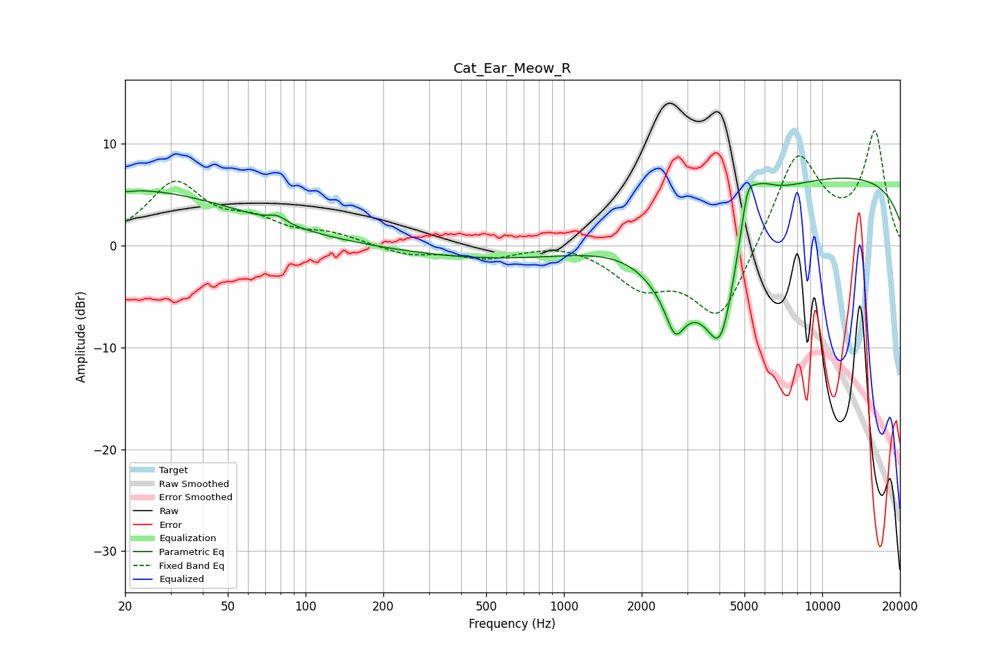

# Cat_Ear_Meow_R
See [usage instructions](https://github.com/jaakkopasanen/AutoEq#usage) for more options and info.

### Parametric EQs
Apply preamp of -6.7 dB when using parametric equalizer.

|   # | Type    |   Fc (Hz) |    Q |   Gain (dB) |
|-----|---------|-----------|------|-------------|
|   1 | Peaking |        20 | 5.93 |        -0.2 |
|   2 | Peaking |        20 | 0.32 |         5.5 |
|   3 | Peaking |        78 | 4.26 |         0.7 |
|   4 | Peaking |       623 | 0.36 |        -1.5 |
|   5 | Peaking |      2693 | 4.4  |        -2.9 |
|   6 | Peaking |      2753 | 1.19 |        -6.7 |
|   7 | Peaking |      4045 | 2.01 |       -12.1 |
|   8 | Peaking |      5133 | 5.73 |         3.3 |
|   9 | Peaking |      5568 | 2.15 |         3.9 |
|  10 | Peaking |     10000 | 0.18 |         7   |

### Fixed Band EQs
When using fixed band (also called graphic) equalizer, apply preamp of **-11.3 dB** (if available) and set gains manually with these parameters.

|   # | Type    |   Fc (Hz) |    Q |   Gain (dB) |
|-----|---------|-----------|------|-------------|
|   1 | Peaking |        31 | 1.41 |         5.9 |
|   2 | Peaking |        62 | 1.41 |         1.9 |
|   3 | Peaking |       125 | 1.41 |         1   |
|   4 | Peaking |       250 | 1.41 |        -0.9 |
|   5 | Peaking |       500 | 1.41 |        -1.1 |
|   6 | Peaking |      1000 | 1.41 |         0.5 |
|   7 | Peaking |      2000 | 1.41 |        -3.5 |
|   8 | Peaking |      4000 | 1.41 |        -7.6 |
|   9 | Peaking |      8000 | 1.41 |         9.3 |
|  10 | Peaking |     16000 | 1.41 |        10.9 |

### Graphs

