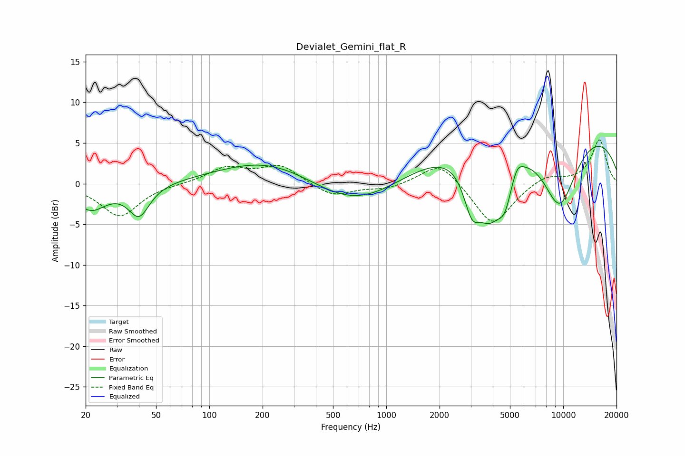

# Devialet_Gemini_flat_R
See [usage instructions](https://github.com/jaakkopasanen/AutoEq#usage) for more options and info.

### Parametric EQs
Apply preamp of -4.7 dB when using parametric equalizer.

|   # | Type    |   Fc (Hz) |    Q |   Gain (dB) |
|-----|---------|-----------|------|-------------|
|   1 | Peaking |        21 | 1.58 |        -3.1 |
|   2 | Peaking |        40 | 2.39 |        -3.8 |
|   3 | Peaking |       218 | 0.52 |         3.1 |
|   4 | Peaking |       675 | 0.57 |        -3.7 |
|   5 | Peaking |      3050 | 2.82 |        -5.5 |
|   6 | Peaking |      3820 | 1.92 |        -7   |
|   7 | Peaking |      4670 | 3.03 |        -4.6 |
|   8 | Peaking |      5474 | 4.39 |         1.4 |
|   9 | Peaking |      7953 | 0.18 |         8.2 |
|  10 | Peaking |      9516 | 1.13 |       -10   |

### Fixed Band EQs
When using fixed band (also called graphic) equalizer, apply preamp of **-5.5 dB** (if available) and set gains manually with these parameters.

|   # | Type    |   Fc (Hz) |    Q |   Gain (dB) |
|-----|---------|-----------|------|-------------|
|   1 | Peaking |        31 | 1.41 |        -4   |
|   2 | Peaking |        62 | 1.41 |        -0   |
|   3 | Peaking |       125 | 1.41 |         1.9 |
|   4 | Peaking |       250 | 1.41 |         2.2 |
|   5 | Peaking |       500 | 1.41 |        -1.6 |
|   6 | Peaking |      1000 | 1.41 |        -0.7 |
|   7 | Peaking |      2000 | 1.41 |         2.9 |
|   8 | Peaking |      4000 | 1.41 |        -5.3 |
|   9 | Peaking |      8000 | 1.41 |         1.1 |
|  10 | Peaking |     16000 | 1.41 |         5.4 |

### Graphs

