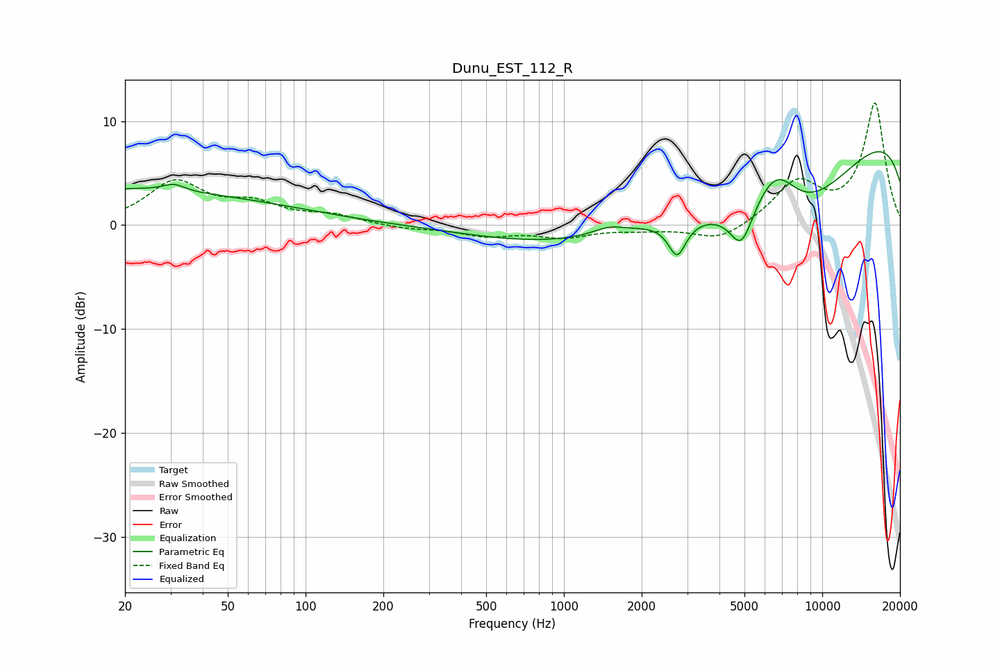

# Dunu_EST_112_R
See [usage instructions](https://github.com/jaakkopasanen/AutoEq#usage) for more options and info.

### Parametric EQs
Apply preamp of -7.2 dB when using parametric equalizer.

|   # | Type    |   Fc (Hz) |    Q |   Gain (dB) |
|-----|---------|-----------|------|-------------|
|   1 | Peaking |        20 | 0.21 |         3.2 |
|   2 | Peaking |        21 | 0.95 |         0.2 |
|   3 | Peaking |        31 | 3.43 |         0.7 |
|   4 | Peaking |      1488 | 2.3  |         0.7 |
|   5 | Peaking |      1497 | 0.34 |        -3.2 |
|   6 | Peaking |      2745 | 4.16 |        -3.3 |
|   7 | Peaking |      4860 | 3.16 |        -3.8 |
|   8 | Peaking |      6630 | 1.5  |         5.4 |
|   9 | Peaking |      7521 | 0.44 |       -12.2 |
|  10 | Peaking |     10000 | 0.18 |        13.1 |

### Fixed Band EQs
When using fixed band (also called graphic) equalizer, apply preamp of **-11.8 dB** (if available) and set gains manually with these parameters.

|   # | Type    |   Fc (Hz) |    Q |   Gain (dB) |
|-----|---------|-----------|------|-------------|
|   1 | Peaking |        31 | 1.41 |         4   |
|   2 | Peaking |        62 | 1.41 |         1.7 |
|   3 | Peaking |       125 | 1.41 |         0.8 |
|   4 | Peaking |       250 | 1.41 |        -0.4 |
|   5 | Peaking |       500 | 1.41 |        -0.9 |
|   6 | Peaking |      1000 | 1.41 |        -1   |
|   7 | Peaking |      2000 | 1.41 |        -0.3 |
|   8 | Peaking |      4000 | 1.41 |        -1.6 |
|   9 | Peaking |      8000 | 1.41 |         3.9 |
|  10 | Peaking |     16000 | 1.41 |        11.6 |

### Graphs

