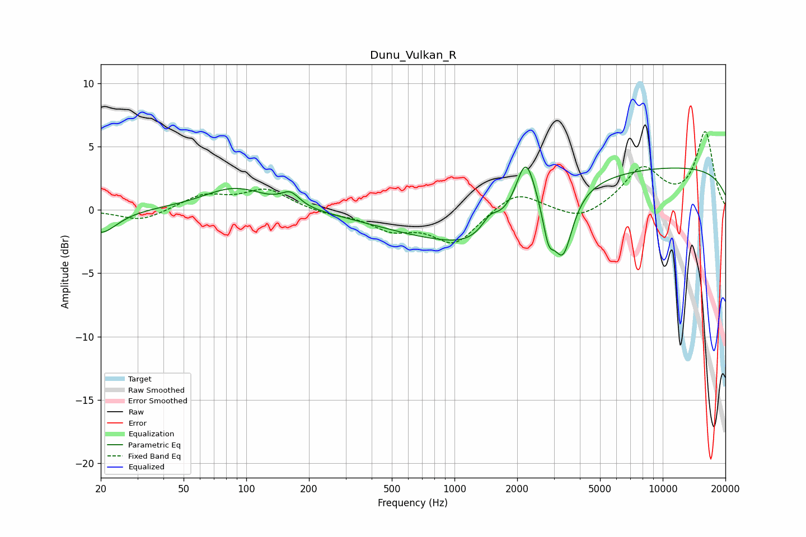

# Dunu_Vulkan_R
See [usage instructions](https://github.com/jaakkopasanen/AutoEq#usage) for more options and info.

### Parametric EQs
Apply preamp of -3.5 dB when using parametric equalizer.

|   # | Type    |   Fc (Hz) |    Q |   Gain (dB) |
|-----|---------|-----------|------|-------------|
|   1 | Peaking |        20 | 1.82 |        -1.9 |
|   2 | Peaking |        88 | 0.94 |         1.8 |
|   3 | Peaking |       163 | 3.23 |         1   |
|   4 | Peaking |      1044 | 0.42 |        -2.6 |
|   5 | Peaking |      1171 | 1.3  |        -0.7 |
|   6 | Peaking |      1479 | 3.89 |         1   |
|   7 | Peaking |      2200 | 3.09 |         4.3 |
|   8 | Peaking |      2827 | 5.39 |        -2.5 |
|   9 | Peaking |      3317 | 3.06 |        -4.9 |
|  10 | Peaking |     10000 | 0.18 |         3.4 |

### Fixed Band EQs
When using fixed band (also called graphic) equalizer, apply preamp of **-6.3 dB** (if available) and set gains manually with these parameters.

|   # | Type    |   Fc (Hz) |    Q |   Gain (dB) |
|-----|---------|-----------|------|-------------|
|   1 | Peaking |        31 | 1.41 |        -0.9 |
|   2 | Peaking |        62 | 1.41 |         1.1 |
|   3 | Peaking |       125 | 1.41 |         1.6 |
|   4 | Peaking |       250 | 1.41 |        -0.3 |
|   5 | Peaking |       500 | 1.41 |        -1.4 |
|   6 | Peaking |      1000 | 1.41 |        -2.6 |
|   7 | Peaking |      2000 | 1.41 |         1.6 |
|   8 | Peaking |      4000 | 1.41 |        -1   |
|   9 | Peaking |      8000 | 1.41 |         3.2 |
|  10 | Peaking |     16000 | 1.41 |         6   |

### Graphs

