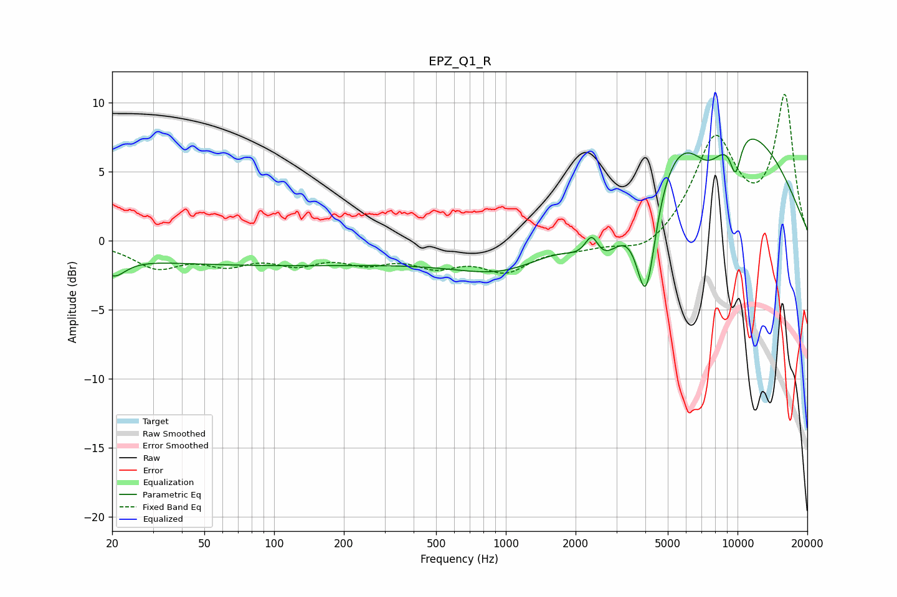

# EPZ_Q1_R
See [usage instructions](https://github.com/jaakkopasanen/AutoEq#usage) for more options and info.

### Parametric EQs
Apply preamp of -7.4 dB when using parametric equalizer.

|   # | Type    |   Fc (Hz) |    Q |   Gain (dB) |
|-----|---------|-----------|------|-------------|
|   1 | Peaking |        20 | 2.2  |        -0.7 |
|   2 | Peaking |        20 | 3.14 |        -0.8 |
|   3 | Peaking |        95 | 0.18 |        -1.8 |
|   4 | Peaking |      1096 | 0.59 |        -3.3 |
|   5 | Peaking |      2350 | 4.51 |         2.1 |
|   6 | Peaking |      2576 | 1.19 |        -6.4 |
|   7 | Peaking |      4030 | 2.97 |        -9.3 |
|   8 | Peaking |      6567 | 0.3  |        11.5 |
|   9 | Peaking |      7487 | 1.52 |        -4.1 |
|  10 | Peaking |      9800 | 4.86 |        -2.9 |

### Fixed Band EQs
When using fixed band (also called graphic) equalizer, apply preamp of **-10.7 dB** (if available) and set gains manually with these parameters.

|   # | Type    |   Fc (Hz) |    Q |   Gain (dB) |
|-----|---------|-----------|------|-------------|
|   1 | Peaking |        31 | 1.41 |        -1.8 |
|   2 | Peaking |        62 | 1.41 |        -1.4 |
|   3 | Peaking |       125 | 1.41 |        -1.4 |
|   4 | Peaking |       250 | 1.41 |        -1.3 |
|   5 | Peaking |       500 | 1.41 |        -1.5 |
|   6 | Peaking |      1000 | 1.41 |        -2   |
|   7 | Peaking |      2000 | 1.41 |        -0.5 |
|   8 | Peaking |      4000 | 1.41 |        -1.2 |
|   9 | Peaking |      8000 | 1.41 |         7.2 |
|  10 | Peaking |     16000 | 1.41 |        10.3 |

### Graphs

