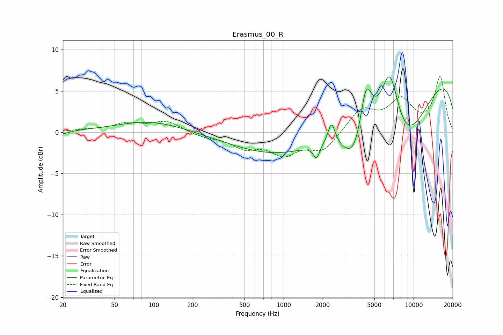

# Erasmus_00_R
See [usage instructions](https://github.com/jaakkopasanen/AutoEq#usage) for more options and info.

### Parametric EQs
Apply preamp of -6.8 dB when using parametric equalizer.

|   # | Type    |   Fc (Hz) |    Q |   Gain (dB) |
|-----|---------|-----------|------|-------------|
|   1 | Peaking |        20 | 3.48 |        -0.4 |
|   2 | Peaking |        93 | 0.54 |         1.4 |
|   3 | Peaking |      1790 | 6    |        -1.7 |
|   4 | Peaking |      2338 | 5.16 |         2.7 |
|   5 | Peaking |      2401 | 0.18 |        -4.3 |
|   6 | Peaking |      3543 | 1.55 |        -4.7 |
|   7 | Peaking |      4297 | 2.89 |         6.7 |
|   8 | Peaking |      6573 | 1.76 |         9.3 |
|   9 | Peaking |      8143 | 0.65 |        -8.5 |
|  10 | Peaking |     10000 | 0.18 |         8.8 |

### Fixed Band EQs
When using fixed band (also called graphic) equalizer, apply preamp of **-6.8 dB** (if available) and set gains manually with these parameters.

|   # | Type    |   Fc (Hz) |    Q |   Gain (dB) |
|-----|---------|-----------|------|-------------|
|   1 | Peaking |        31 | 1.41 |         0.2 |
|   2 | Peaking |        62 | 1.41 |         1   |
|   3 | Peaking |       125 | 1.41 |         1.3 |
|   4 | Peaking |       250 | 1.41 |        -0.5 |
|   5 | Peaking |       500 | 1.41 |        -1.7 |
|   6 | Peaking |      1000 | 1.41 |        -2.4 |
|   7 | Peaking |      2000 | 1.41 |        -2.2 |
|   8 | Peaking |      4000 | 1.41 |         2.7 |
|   9 | Peaking |      8000 | 1.41 |         3.6 |
|  10 | Peaking |     16000 | 1.41 |         6.6 |

### Graphs

