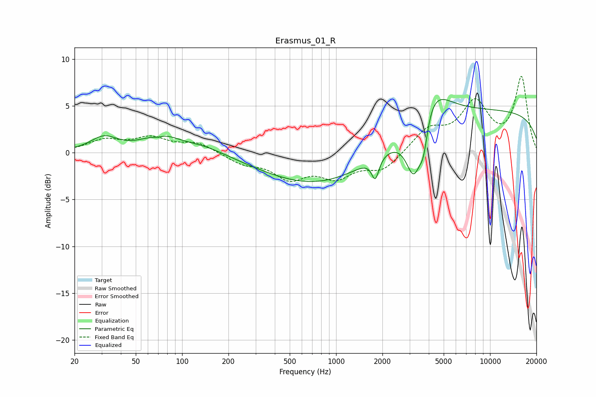

# Erasmus_01_R
See [usage instructions](https://github.com/jaakkopasanen/AutoEq#usage) for more options and info.

### Parametric EQs
Apply preamp of -5.8 dB when using parametric equalizer.

|   # | Type    |   Fc (Hz) |    Q |   Gain (dB) |
|-----|---------|-----------|------|-------------|
|   1 | Peaking |        31 | 1.63 |         1.5 |
|   2 | Peaking |        69 | 3.71 |        -0.3 |
|   3 | Peaking |        72 | 1.23 |         1.7 |
|   4 | Peaking |       138 | 0.9  |         0.9 |
|   5 | Peaking |       793 | 0.38 |        -3.6 |
|   6 | Peaking |      1798 | 6    |        -2.3 |
|   7 | Peaking |      3219 | 2.54 |        -6.9 |
|   8 | Peaking |      3699 | 5.26 |        -3   |
|   9 | Peaking |      4032 | 1.26 |         4.8 |
|  10 | Peaking |     10000 | 0.18 |         4.4 |

### Fixed Band EQs
When using fixed band (also called graphic) equalizer, apply preamp of **-8.2 dB** (if available) and set gains manually with these parameters.

|   # | Type    |   Fc (Hz) |    Q |   Gain (dB) |
|-----|---------|-----------|------|-------------|
|   1 | Peaking |        31 | 1.41 |         1.2 |
|   2 | Peaking |        62 | 1.41 |         1.4 |
|   3 | Peaking |       125 | 1.41 |         1   |
|   4 | Peaking |       250 | 1.41 |        -1   |
|   5 | Peaking |       500 | 1.41 |        -2.5 |
|   6 | Peaking |      1000 | 1.41 |        -2.3 |
|   7 | Peaking |      2000 | 1.41 |        -1.8 |
|   8 | Peaking |      4000 | 1.41 |         2.4 |
|   9 | Peaking |      8000 | 1.41 |         5.1 |
|  10 | Peaking |     16000 | 1.41 |         7.9 |

### Graphs

