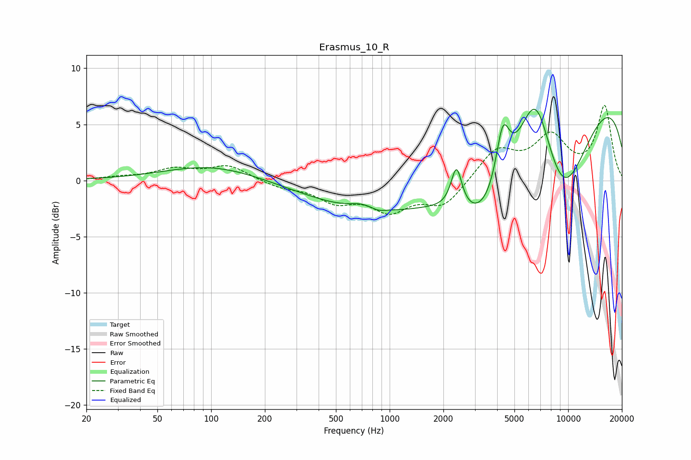

# Erasmus_10_R
See [usage instructions](https://github.com/jaakkopasanen/AutoEq#usage) for more options and info.

### Parametric EQs
Apply preamp of -6.4 dB when using parametric equalizer.

|   # | Type    |   Fc (Hz) |    Q |   Gain (dB) |
|-----|---------|-----------|------|-------------|
|   1 | Peaking |       101 | 0.54 |         1.4 |
|   2 | Peaking |       696 | 2.01 |         0.5 |
|   3 | Peaking |       862 | 4.06 |        -0.2 |
|   4 | Peaking |      2225 | 0.18 |        -4.4 |
|   5 | Peaking |      2368 | 4.71 |         3.8 |
|   6 | Peaking |      3483 | 0.82 |        -5.7 |
|   7 | Peaking |      4301 | 3.57 |         5.3 |
|   8 | Peaking |      6573 | 1.31 |         9   |
|   9 | Peaking |      9145 | 0.75 |       -10.1 |
|  10 | Peaking |      9788 | 0.19 |        10   |

### Fixed Band EQs
When using fixed band (also called graphic) equalizer, apply preamp of **-6.8 dB** (if available) and set gains manually with these parameters.

|   # | Type    |   Fc (Hz) |    Q |   Gain (dB) |
|-----|---------|-----------|------|-------------|
|   1 | Peaking |        31 | 1.41 |         0.2 |
|   2 | Peaking |        62 | 1.41 |         0.9 |
|   3 | Peaking |       125 | 1.41 |         1.3 |
|   4 | Peaking |       250 | 1.41 |        -0.6 |
|   5 | Peaking |       500 | 1.41 |        -1.7 |
|   6 | Peaking |      1000 | 1.41 |        -2.4 |
|   7 | Peaking |      2000 | 1.41 |        -2.2 |
|   8 | Peaking |      4000 | 1.41 |         2.7 |
|   9 | Peaking |      8000 | 1.41 |         3.7 |
|  10 | Peaking |     16000 | 1.41 |         6.5 |

### Graphs

