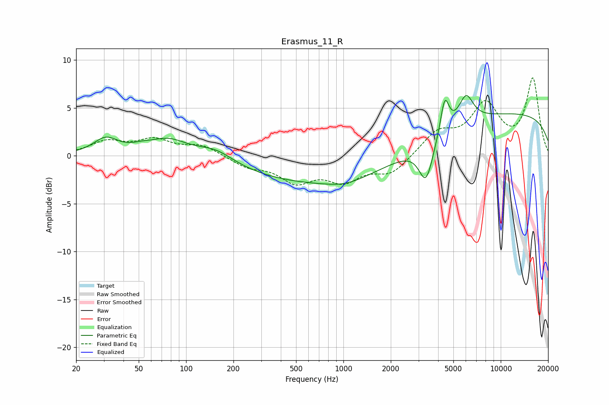

# Erasmus_11_R
See [usage instructions](https://github.com/jaakkopasanen/AutoEq#usage) for more options and info.

### Parametric EQs
Apply preamp of -6.4 dB when using parametric equalizer.

|   # | Type    |   Fc (Hz) |    Q |   Gain (dB) |
|-----|---------|-----------|------|-------------|
|   1 | Peaking |        31 | 1.83 |         1.7 |
|   2 | Peaking |        52 | 2.24 |         0.3 |
|   3 | Peaking |        77 | 1.14 |         1.7 |
|   4 | Peaking |       154 | 1.21 |         1.3 |
|   5 | Peaking |       915 | 0.23 |        -3.1 |
|   6 | Peaking |      1034 | 1.12 |        -0.6 |
|   7 | Peaking |      3352 | 3.14 |        -4.2 |
|   8 | Peaking |      4408 | 5.14 |         3.7 |
|   9 | Peaking |      6017 | 2.98 |         2.9 |
|  10 | Peaking |     10000 | 0.18 |         4.6 |

### Fixed Band EQs
When using fixed band (also called graphic) equalizer, apply preamp of **-8.2 dB** (if available) and set gains manually with these parameters.

|   # | Type    |   Fc (Hz) |    Q |   Gain (dB) |
|-----|---------|-----------|------|-------------|
|   1 | Peaking |        31 | 1.41 |         1.4 |
|   2 | Peaking |        62 | 1.41 |         1.5 |
|   3 | Peaking |       125 | 1.41 |         1.1 |
|   4 | Peaking |       250 | 1.41 |        -1   |
|   5 | Peaking |       500 | 1.41 |        -2.5 |
|   6 | Peaking |      1000 | 1.41 |        -2.3 |
|   7 | Peaking |      2000 | 1.41 |        -1.8 |
|   8 | Peaking |      4000 | 1.41 |         2.3 |
|   9 | Peaking |      8000 | 1.41 |         5.1 |
|  10 | Peaking |     16000 | 1.41 |         7.9 |

### Graphs

