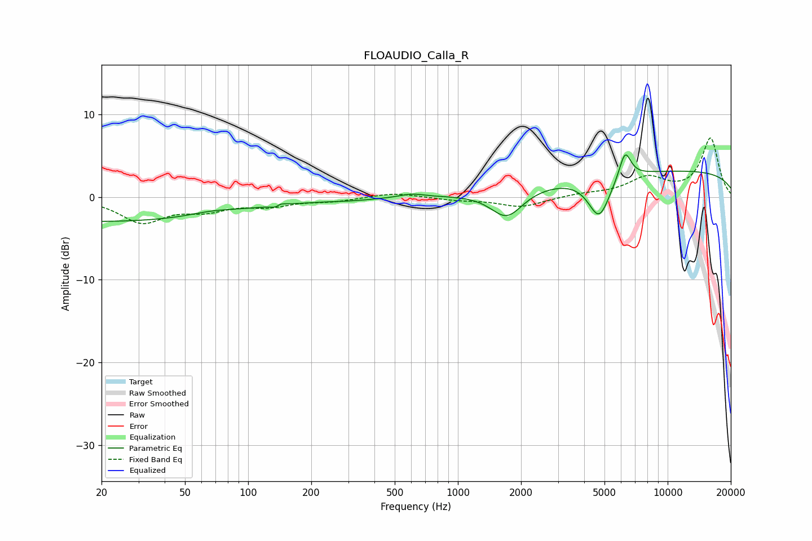

# FLOAUDIO_Calla_R
See [usage instructions](https://github.com/jaakkopasanen/AutoEq#usage) for more options and info.

### Parametric EQs
Apply preamp of -5.2 dB when using parametric equalizer.

|   # | Type    |   Fc (Hz) |    Q |   Gain (dB) |
|-----|---------|-----------|------|-------------|
|   1 | Peaking |        20 | 0.2  |        -3   |
|   2 | Peaking |        68 | 1.3  |         0.5 |
|   3 | Peaking |       138 | 5.93 |        -1.9 |
|   4 | Peaking |       139 | 5.89 |         1.8 |
|   5 | Peaking |       309 | 1.1  |        -0.2 |
|   6 | Peaking |       604 | 2.5  |         0.4 |
|   7 | Peaking |      1712 | 1.85 |        -3.4 |
|   8 | Peaking |      4715 | 2.68 |        -5   |
|   9 | Peaking |      6266 | 4.8  |         3.4 |
|  10 | Peaking |     10000 | 0.18 |         3.2 |

### Fixed Band EQs
When using fixed band (also called graphic) equalizer, apply preamp of **-7.2 dB** (if available) and set gains manually with these parameters.

|   # | Type    |   Fc (Hz) |    Q |   Gain (dB) |
|-----|---------|-----------|------|-------------|
|   1 | Peaking |        31 | 1.41 |        -2.9 |
|   2 | Peaking |        62 | 1.41 |        -1.3 |
|   3 | Peaking |       125 | 1.41 |        -0.9 |
|   4 | Peaking |       250 | 1.41 |        -0.4 |
|   5 | Peaking |       500 | 1.41 |         0.6 |
|   6 | Peaking |      1000 | 1.41 |        -0.3 |
|   7 | Peaking |      2000 | 1.41 |        -1.2 |
|   8 | Peaking |      4000 | 1.41 |         0.3 |
|   9 | Peaking |      8000 | 1.41 |         2.2 |
|  10 | Peaking |     16000 | 1.41 |         7.1 |

### Graphs

