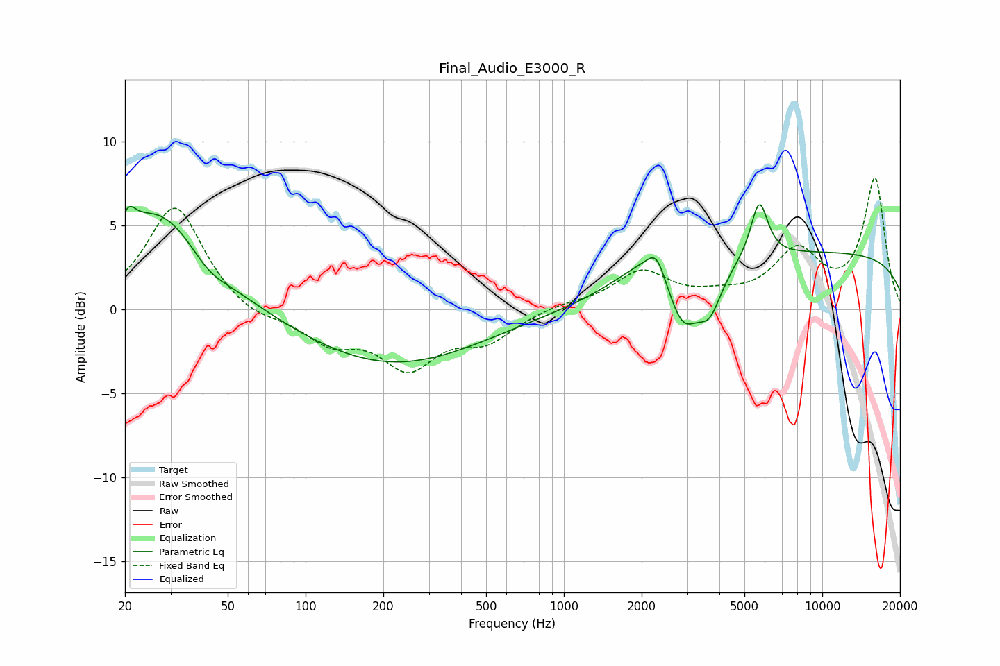

# Final_Audio_E3000_R
See [usage instructions](https://github.com/jaakkopasanen/AutoEq#usage) for more options and info.

### Parametric EQs
Apply preamp of -6.4 dB when using parametric equalizer.

|   # | Type    |   Fc (Hz) |    Q |   Gain (dB) |
|-----|---------|-----------|------|-------------|
|   1 | Peaking |        21 | 5.26 |         1.3 |
|   2 | Peaking |        27 | 0.76 |         6   |
|   3 | Peaking |        42 | 1.97 |        -0.9 |
|   4 | Peaking |       215 | 0.41 |        -3.3 |
|   5 | Peaking |      2153 | 1.16 |         1.9 |
|   6 | Peaking |      2282 | 4.09 |         1.4 |
|   7 | Peaking |      2884 | 2.2  |        -3.8 |
|   8 | Peaking |      3669 | 3.01 |        -2.3 |
|   9 | Peaking |      5705 | 4.12 |         3.4 |
|  10 | Peaking |     10000 | 0.18 |         3.4 |

### Fixed Band EQs
When using fixed band (also called graphic) equalizer, apply preamp of **-7.9 dB** (if available) and set gains manually with these parameters.

|   # | Type    |   Fc (Hz) |    Q |   Gain (dB) |
|-----|---------|-----------|------|-------------|
|   1 | Peaking |        31 | 1.41 |         6.3 |
|   2 | Peaking |        62 | 1.41 |        -0.7 |
|   3 | Peaking |       125 | 1.41 |        -1.8 |
|   4 | Peaking |       250 | 1.41 |        -3.2 |
|   5 | Peaking |       500 | 1.41 |        -1.7 |
|   6 | Peaking |      1000 | 1.41 |         0.3 |
|   7 | Peaking |      2000 | 1.41 |         2.2 |
|   8 | Peaking |      4000 | 1.41 |         0.5 |
|   9 | Peaking |      8000 | 1.41 |         3.3 |
|  10 | Peaking |     16000 | 1.41 |         7.7 |

### Graphs

