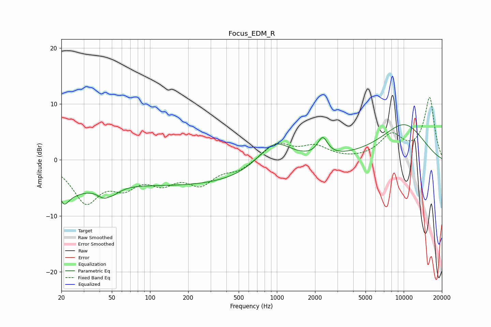

# Focus_EDM_R
See [usage instructions](https://github.com/jaakkopasanen/AutoEq#usage) for more options and info.

### Parametric EQs
Apply preamp of -6.4 dB when using parametric equalizer.

|   # | Type    |   Fc (Hz) |    Q |   Gain (dB) |
|-----|---------|-----------|------|-------------|
|   1 | Peaking |        21 | 4.48 |        -6.4 |
|   2 | Peaking |        21 | 5.37 |         3.4 |
|   3 | Peaking |        23 | 0.73 |        -2.1 |
|   4 | Peaking |        25 | 1.36 |        -1.5 |
|   5 | Peaking |        46 | 2.43 |        -4.8 |
|   6 | Peaking |        47 | 3.38 |         2.5 |
|   7 | Peaking |       188 | 0.19 |        -4.5 |
|   8 | Peaking |       958 | 1.04 |         5   |
|   9 | Peaking |      2296 | 3.62 |         3.2 |
|  10 | Peaking |     10000 | 0.66 |         6.3 |

### Fixed Band EQs
When using fixed band (also called graphic) equalizer, apply preamp of **-11.2 dB** (if available) and set gains manually with these parameters.

|   # | Type    |   Fc (Hz) |    Q |   Gain (dB) |
|-----|---------|-----------|------|-------------|
|   1 | Peaking |        31 | 1.41 |        -7.1 |
|   2 | Peaking |        62 | 1.41 |        -3.8 |
|   3 | Peaking |       125 | 1.41 |        -3.3 |
|   4 | Peaking |       250 | 1.41 |        -3.8 |
|   5 | Peaking |       500 | 1.41 |        -1.7 |
|   6 | Peaking |      1000 | 1.41 |         3   |
|   7 | Peaking |      2000 | 1.41 |         2.2 |
|   8 | Peaking |      4000 | 1.41 |        -0.1 |
|   9 | Peaking |      8000 | 1.41 |         4.1 |
|  10 | Peaking |     16000 | 1.41 |        11   |

### Graphs

