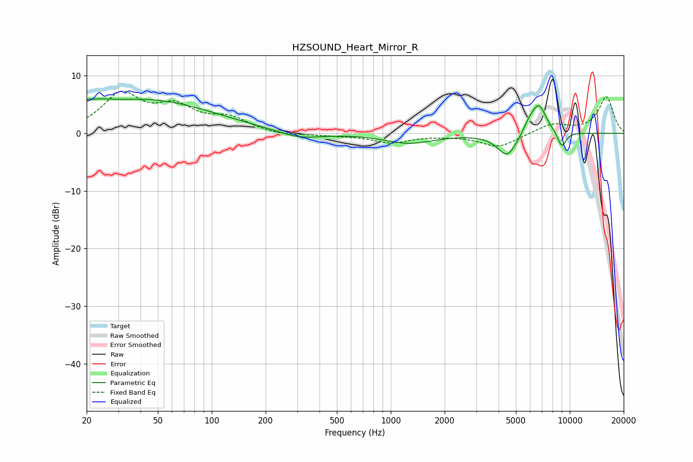

# HZSOUND_Heart_Mirror_R
See [usage instructions](https://github.com/jaakkopasanen/AutoEq#usage) for more options and info.

### Parametric EQs
Apply preamp of -6.1 dB when using parametric equalizer.

|   # | Type    |   Fc (Hz) |    Q |   Gain (dB) |
|-----|---------|-----------|------|-------------|
|   1 | Peaking |        21 | 5.97 |         3.1 |
|   2 | Peaking |        21 | 6    |        -2.9 |
|   3 | Peaking |        22 | 1.69 |         1.5 |
|   4 | Peaking |        43 | 0.37 |         5.7 |
|   5 | Peaking |       309 | 1.17 |        -1.2 |
|   6 | Peaking |      1267 | 1.04 |        -1.7 |
|   7 | Peaking |      4479 | 2.52 |        -4.1 |
|   8 | Peaking |      5910 | 4.09 |         1.3 |
|   9 | Peaking |      6714 | 3.11 |         5.1 |
|  10 | Peaking |      9026 | 5.25 |        -2.7 |

### Fixed Band EQs
When using fixed band (also called graphic) equalizer, apply preamp of **-7.4 dB** (if available) and set gains manually with these parameters.

|   # | Type    |   Fc (Hz) |    Q |   Gain (dB) |
|-----|---------|-----------|------|-------------|
|   1 | Peaking |        31 | 1.41 |         6.5 |
|   2 | Peaking |        62 | 1.41 |         4   |
|   3 | Peaking |       125 | 1.41 |         2.4 |
|   4 | Peaking |       250 | 1.41 |        -0.5 |
|   5 | Peaking |       500 | 1.41 |        -0.3 |
|   6 | Peaking |      1000 | 1.41 |        -1.5 |
|   7 | Peaking |      2000 | 1.41 |        -0.2 |
|   8 | Peaking |      4000 | 1.41 |        -2.4 |
|   9 | Peaking |      8000 | 1.41 |         1.6 |
|  10 | Peaking |     16000 | 1.41 |         6.3 |

### Graphs

