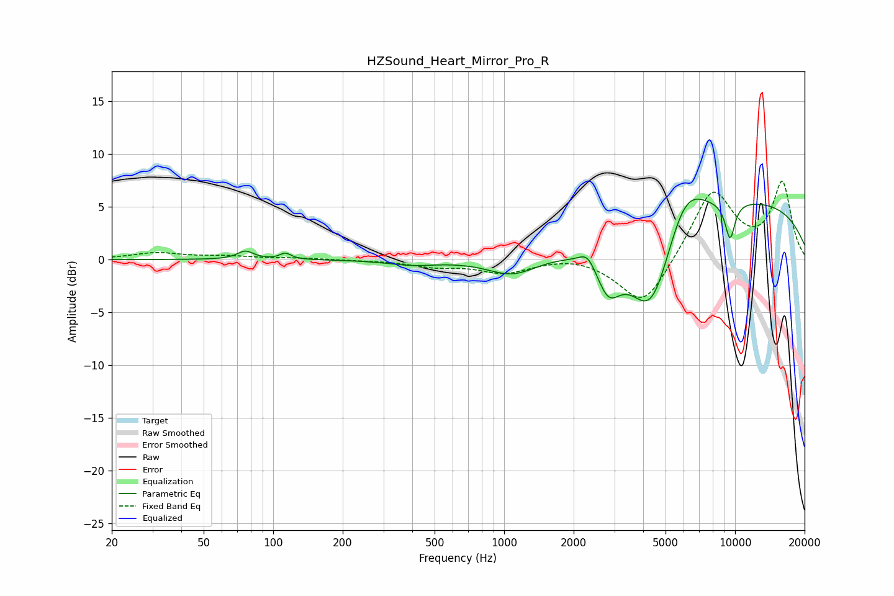

# HZSound_Heart_Mirror_Pro_R
See [usage instructions](https://github.com/jaakkopasanen/AutoEq#usage) for more options and info.

### Parametric EQs
Apply preamp of -5.8 dB when using parametric equalizer.

|   # | Type    |   Fc (Hz) |    Q |   Gain (dB) |
|-----|---------|-----------|------|-------------|
|   1 | Peaking |        76 | 4.1  |         0.8 |
|   2 | Peaking |       113 | 5.95 |         0.6 |
|   3 | Peaking |       401 | 1.31 |        -0.5 |
|   4 | Peaking |      1088 | 1.31 |        -1.7 |
|   5 | Peaking |      2300 | 3.98 |         1.3 |
|   6 | Peaking |      2826 | 2.69 |        -3.5 |
|   7 | Peaking |      4349 | 1.34 |        -9.5 |
|   8 | Peaking |      6033 | 1.51 |         4.7 |
|   9 | Peaking |      9511 | 5.72 |        -3.5 |
|  10 | Peaking |     10000 | 0.23 |         5.6 |

### Fixed Band EQs
When using fixed band (also called graphic) equalizer, apply preamp of **-7.5 dB** (if available) and set gains manually with these parameters.

|   # | Type    |   Fc (Hz) |    Q |   Gain (dB) |
|-----|---------|-----------|------|-------------|
|   1 | Peaking |        31 | 1.41 |         0.6 |
|   2 | Peaking |        62 | 1.41 |         0.3 |
|   3 | Peaking |       125 | 1.41 |         0.1 |
|   4 | Peaking |       250 | 1.41 |        -0   |
|   5 | Peaking |       500 | 1.41 |        -0.6 |
|   6 | Peaking |      1000 | 1.41 |        -1.2 |
|   7 | Peaking |      2000 | 1.41 |         0.4 |
|   8 | Peaking |      4000 | 1.41 |        -4.7 |
|   9 | Peaking |      8000 | 1.41 |         6.7 |
|  10 | Peaking |     16000 | 1.41 |         7.2 |

### Graphs

