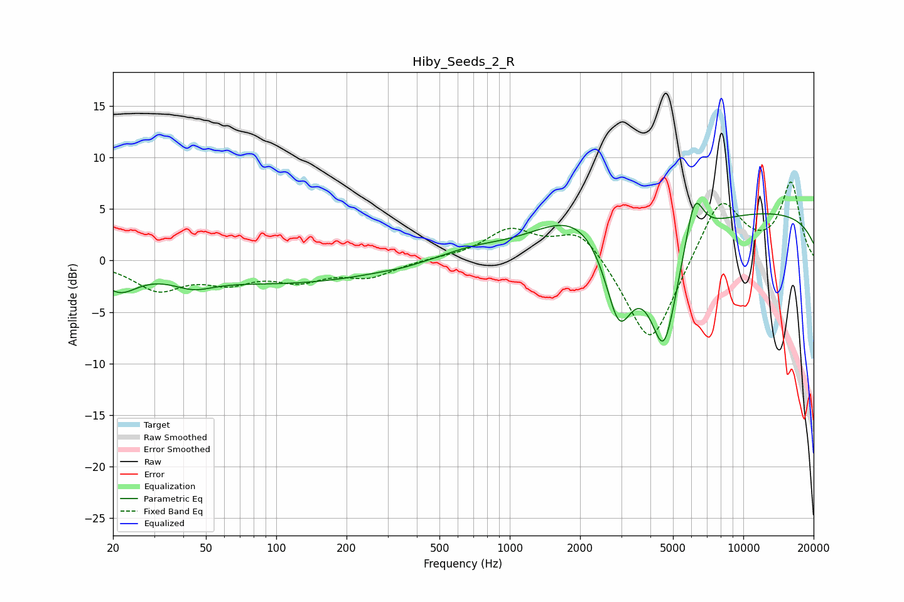

# Hiby_Seeds_2_R
See [usage instructions](https://github.com/jaakkopasanen/AutoEq#usage) for more options and info.

### Parametric EQs
Apply preamp of -5.6 dB when using parametric equalizer.

|   # | Type    |   Fc (Hz) |    Q |   Gain (dB) |
|-----|---------|-----------|------|-------------|
|   1 | Peaking |        21 | 1.79 |        -2.4 |
|   2 | Peaking |        44 | 1.59 |        -1.2 |
|   3 | Peaking |       111 | 0.34 |        -2.1 |
|   4 | Peaking |       350 | 2.81 |        -0.1 |
|   5 | Peaking |       679 | 1.03 |         0.8 |
|   6 | Peaking |      1990 | 0.78 |         3.5 |
|   7 | Peaking |      2934 | 2.19 |        -8.9 |
|   8 | Peaking |      4571 | 2.09 |       -12   |
|   9 | Peaking |      6168 | 3.51 |         5.1 |
|  10 | Peaking |     10000 | 0.18 |         4.8 |

### Fixed Band EQs
When using fixed band (also called graphic) equalizer, apply preamp of **-7.7 dB** (if available) and set gains manually with these parameters.

|   # | Type    |   Fc (Hz) |    Q |   Gain (dB) |
|-----|---------|-----------|------|-------------|
|   1 | Peaking |        31 | 1.41 |        -2.7 |
|   2 | Peaking |        62 | 1.41 |        -1.8 |
|   3 | Peaking |       125 | 1.41 |        -1.7 |
|   4 | Peaking |       250 | 1.41 |        -1.5 |
|   5 | Peaking |       500 | 1.41 |         0.2 |
|   6 | Peaking |      1000 | 1.41 |         2.9 |
|   7 | Peaking |      2000 | 1.41 |         3.2 |
|   8 | Peaking |      4000 | 1.41 |        -8.9 |
|   9 | Peaking |      8000 | 1.41 |         6.4 |
|  10 | Peaking |     16000 | 1.41 |         7.4 |

### Graphs

