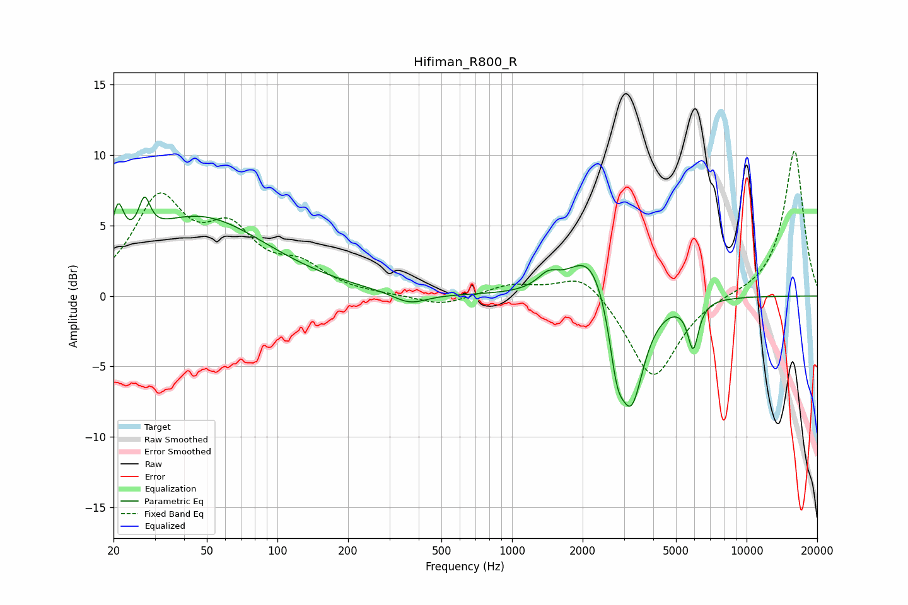

# Hifiman_R800_R
See [usage instructions](https://github.com/jaakkopasanen/AutoEq#usage) for more options and info.

### Parametric EQs
Apply preamp of -7.1 dB when using parametric equalizer.

|   # | Type    |   Fc (Hz) |    Q |   Gain (dB) |
|-----|---------|-----------|------|-------------|
|   1 | Peaking |        21 | 5.87 |         3.1 |
|   2 | Peaking |        27 | 5.89 |         2.4 |
|   3 | Peaking |        46 | 0.49 |         5.6 |
|   4 | Peaking |       366 | 1.93 |        -0.8 |
|   5 | Peaking |      1424 | 3.18 |         1   |
|   6 | Peaking |      2166 | 1.56 |         3.6 |
|   7 | Peaking |      2795 | 4.62 |        -2.9 |
|   8 | Peaking |      2806 | 3.94 |        -0.7 |
|   9 | Peaking |      3227 | 2.57 |        -7.8 |
|  10 | Peaking |      5918 | 5.94 |        -3.3 |

### Fixed Band EQs
When using fixed band (also called graphic) equalizer, apply preamp of **-10.4 dB** (if available) and set gains manually with these parameters.

|   # | Type    |   Fc (Hz) |    Q |   Gain (dB) |
|-----|---------|-----------|------|-------------|
|   1 | Peaking |        31 | 1.41 |         6.5 |
|   2 | Peaking |        62 | 1.41 |         3.9 |
|   3 | Peaking |       125 | 1.41 |         1.8 |
|   4 | Peaking |       250 | 1.41 |         0   |
|   5 | Peaking |       500 | 1.41 |        -0.7 |
|   6 | Peaking |      1000 | 1.41 |         0.8 |
|   7 | Peaking |      2000 | 1.41 |         1.8 |
|   8 | Peaking |      4000 | 1.41 |        -6   |
|   9 | Peaking |      8000 | 1.41 |         0.1 |
|  10 | Peaking |     16000 | 1.41 |        10.4 |

### Graphs

