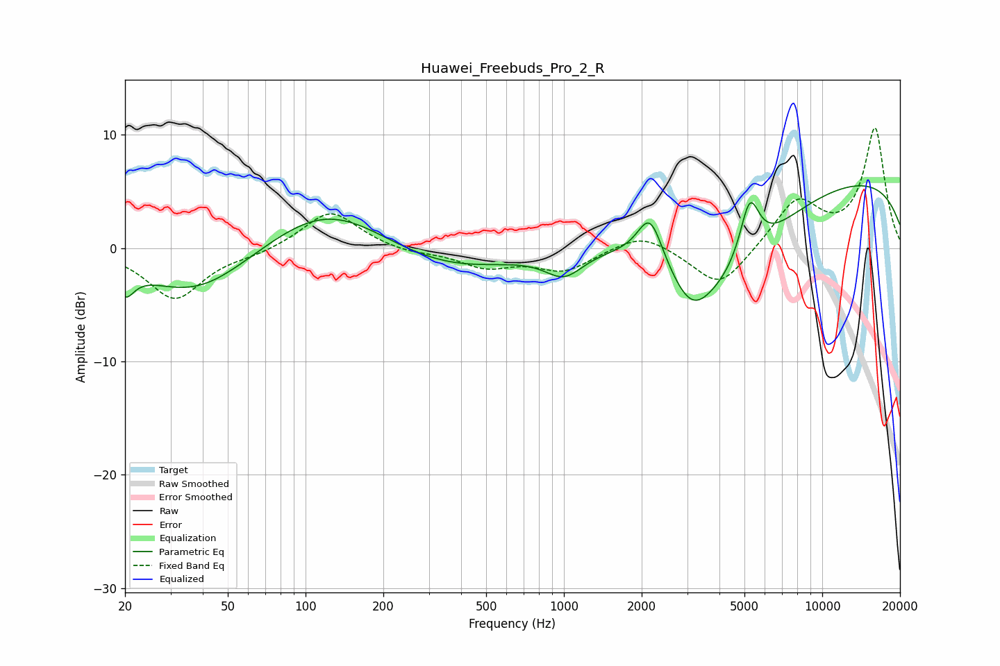

# Huawei_Freebuds_Pro_2_R
See [usage instructions](https://github.com/jaakkopasanen/AutoEq#usage) for more options and info.

### Parametric EQs
Apply preamp of -5.6 dB when using parametric equalizer.

|   # | Type    |   Fc (Hz) |    Q |   Gain (dB) |
|-----|---------|-----------|------|-------------|
|   1 | Peaking |        20 | 4.08 |        -2.3 |
|   2 | Peaking |        37 | 0.67 |        -4.2 |
|   3 | Peaking |       122 | 0.61 |         4.3 |
|   4 | Peaking |       342 | 0.52 |        -2.3 |
|   5 | Peaking |      1003 | 1.9  |        -2.2 |
|   6 | Peaking |      2157 | 2.9  |         4.2 |
|   7 | Peaking |      3113 | 1.65 |        -3.9 |
|   8 | Peaking |      4161 | 0.63 |        -7.5 |
|   9 | Peaking |      5237 | 3.65 |         5.2 |
|  10 | Peaking |      9432 | 0.18 |         6.7 |

### Fixed Band EQs
When using fixed band (also called graphic) equalizer, apply preamp of **-10.7 dB** (if available) and set gains manually with these parameters.

|   # | Type    |   Fc (Hz) |    Q |   Gain (dB) |
|-----|---------|-----------|------|-------------|
|   1 | Peaking |        31 | 1.41 |        -4.5 |
|   2 | Peaking |        62 | 1.41 |        -0.4 |
|   3 | Peaking |       125 | 1.41 |         3.4 |
|   4 | Peaking |       250 | 1.41 |        -0.4 |
|   5 | Peaking |       500 | 1.41 |        -1.6 |
|   6 | Peaking |      1000 | 1.41 |        -1.9 |
|   7 | Peaking |      2000 | 1.41 |         1.5 |
|   8 | Peaking |      4000 | 1.41 |        -3.7 |
|   9 | Peaking |      8000 | 1.41 |         4.2 |
|  10 | Peaking |     16000 | 1.41 |        10.5 |

### Graphs

