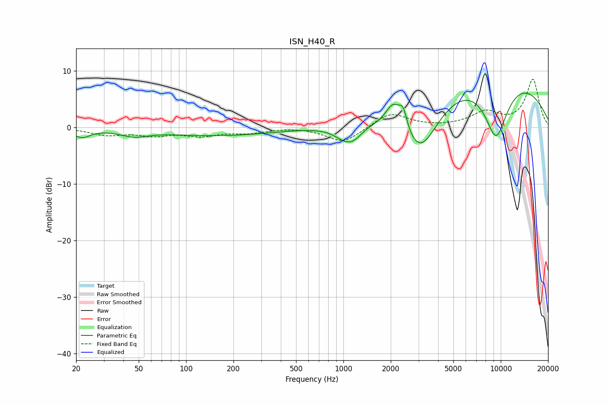

# ISN_H40_R
See [usage instructions](https://github.com/jaakkopasanen/AutoEq#usage) for more options and info.

### Parametric EQs
Apply preamp of -6.2 dB when using parametric equalizer.

|   # | Type    |   Fc (Hz) |    Q |   Gain (dB) |
|-----|---------|-----------|------|-------------|
|   1 | Peaking |        22 | 2.69 |        -1.5 |
|   2 | Peaking |        47 | 1.62 |        -1.1 |
|   3 | Peaking |       159 | 0.4  |        -1.4 |
|   4 | Peaking |      1050 | 2.02 |        -2.8 |
|   5 | Peaking |      1198 | 3.22 |        -0.8 |
|   6 | Peaking |      2073 | 2.91 |         4.3 |
|   7 | Peaking |      2394 | 5.51 |         3.3 |
|   8 | Peaking |      3081 | 1.14 |       -10   |
|   9 | Peaking |      8347 | 0.29 |        11.6 |
|  10 | Peaking |      9331 | 1.47 |       -12.1 |

### Fixed Band EQs
When using fixed band (also called graphic) equalizer, apply preamp of **-8.6 dB** (if available) and set gains manually with these parameters.

|   # | Type    |   Fc (Hz) |    Q |   Gain (dB) |
|-----|---------|-----------|------|-------------|
|   1 | Peaking |        31 | 1.41 |        -1.2 |
|   2 | Peaking |        62 | 1.41 |        -1.2 |
|   3 | Peaking |       125 | 1.41 |        -1.3 |
|   4 | Peaking |       250 | 1.41 |        -0.8 |
|   5 | Peaking |       500 | 1.41 |         0.1 |
|   6 | Peaking |      1000 | 1.41 |        -2.8 |
|   7 | Peaking |      2000 | 1.41 |         2.6 |
|   8 | Peaking |      4000 | 1.41 |         0   |
|   9 | Peaking |      8000 | 1.41 |         2.5 |
|  10 | Peaking |     16000 | 1.41 |         8.4 |

### Graphs

