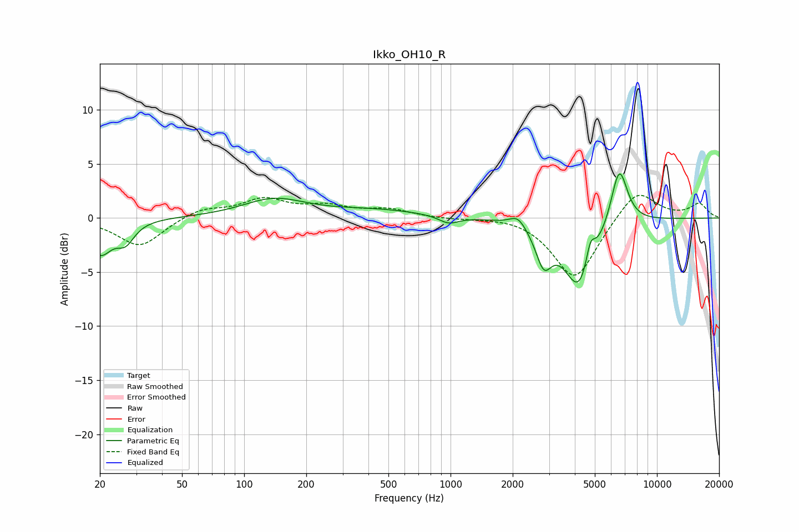

# Ikko_OH10_R
See [usage instructions](https://github.com/jaakkopasanen/AutoEq#usage) for more options and info.

### Parametric EQs
Apply preamp of -4.2 dB when using parametric equalizer.

|   # | Type    |   Fc (Hz) |    Q |   Gain (dB) |
|-----|---------|-----------|------|-------------|
|   1 | Peaking |        20 | 2.44 |        -3.2 |
|   2 | Peaking |        27 | 3.36 |        -1.7 |
|   3 | Peaking |       139 | 0.94 |         1.7 |
|   4 | Peaking |       434 | 0.58 |         0.7 |
|   5 | Peaking |       980 | 2.97 |        -0.7 |
|   6 | Peaking |      2122 | 3.57 |         1.1 |
|   7 | Peaking |      2827 | 3.64 |        -3.2 |
|   8 | Peaking |      4234 | 1.84 |        -6.7 |
|   9 | Peaking |      4754 | 6    |         2.5 |
|  10 | Peaking |      6562 | 3.35 |         5.6 |

### Fixed Band EQs
When using fixed band (also called graphic) equalizer, apply preamp of **-2.2 dB** (if available) and set gains manually with these parameters.

|   # | Type    |   Fc (Hz) |    Q |   Gain (dB) |
|-----|---------|-----------|------|-------------|
|   1 | Peaking |        31 | 1.41 |        -2.7 |
|   2 | Peaking |        62 | 1.41 |         0.9 |
|   3 | Peaking |       125 | 1.41 |         1.6 |
|   4 | Peaking |       250 | 1.41 |         0.9 |
|   5 | Peaking |       500 | 1.41 |         0.7 |
|   6 | Peaking |      1000 | 1.41 |        -0.1 |
|   7 | Peaking |      2000 | 1.41 |         0.2 |
|   8 | Peaking |      4000 | 1.41 |        -5.7 |
|   9 | Peaking |      8000 | 1.41 |         2.8 |
|  10 | Peaking |     16000 | 1.41 |         1.3 |

### Graphs

