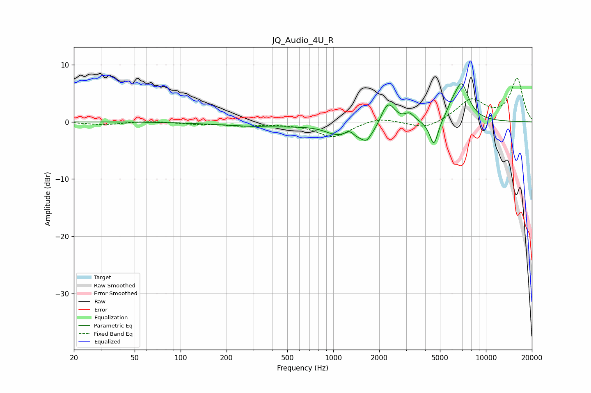

# JQ_Audio_4U_R
See [usage instructions](https://github.com/jaakkopasanen/AutoEq#usage) for more options and info.

### Parametric EQs
Apply preamp of -6.8 dB when using parametric equalizer.

|   # | Type    |   Fc (Hz) |    Q |   Gain (dB) |
|-----|---------|-----------|------|-------------|
|   1 | Peaking |       355 | 0.5  |        -0.8 |
|   2 | Peaking |      1018 | 2.16 |        -1   |
|   3 | Peaking |      1284 | 5.79 |         0.9 |
|   4 | Peaking |      1623 | 1.39 |        -3.1 |
|   5 | Peaking |      1653 | 5.78 |        -0.8 |
|   6 | Peaking |      2275 | 2.97 |         4.5 |
|   7 | Peaking |      3159 | 4.57 |         1.4 |
|   8 | Peaking |      4564 | 4.91 |        -4.7 |
|   9 | Peaking |      5962 | 5.58 |         0.9 |
|  10 | Peaking |      6899 | 2.75 |         6.7 |

### Fixed Band EQs
When using fixed band (also called graphic) equalizer, apply preamp of **-7.7 dB** (if available) and set gains manually with these parameters.

|   # | Type    |   Fc (Hz) |    Q |   Gain (dB) |
|-----|---------|-----------|------|-------------|
|   1 | Peaking |        31 | 1.41 |        -0.5 |
|   2 | Peaking |        62 | 1.41 |         0.2 |
|   3 | Peaking |       125 | 1.41 |        -0.3 |
|   4 | Peaking |       250 | 1.41 |        -0.6 |
|   5 | Peaking |       500 | 1.41 |        -0.2 |
|   6 | Peaking |      1000 | 1.41 |        -2.7 |
|   7 | Peaking |      2000 | 1.41 |         0.9 |
|   8 | Peaking |      4000 | 1.41 |        -1.4 |
|   9 | Peaking |      8000 | 1.41 |         3.8 |
|  10 | Peaking |     16000 | 1.41 |         7.5 |

### Graphs

